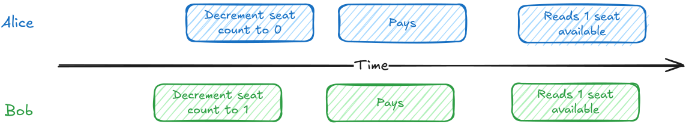
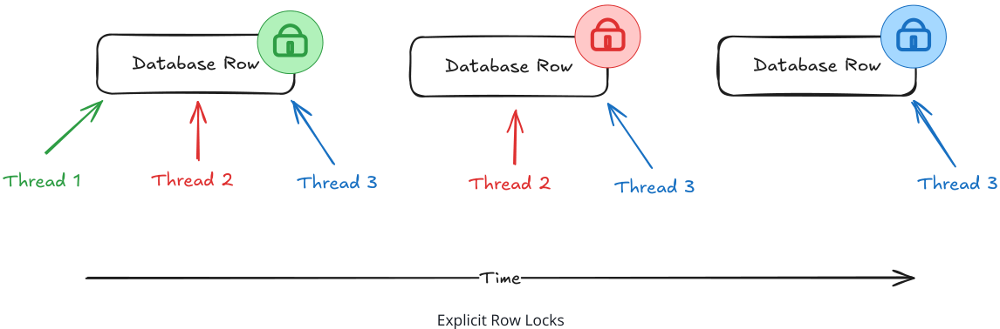
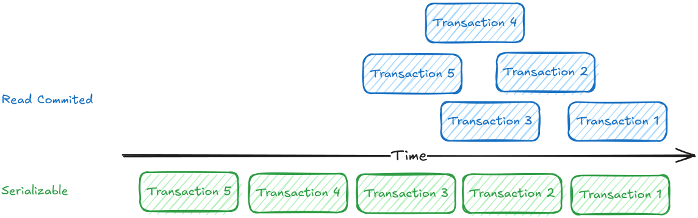
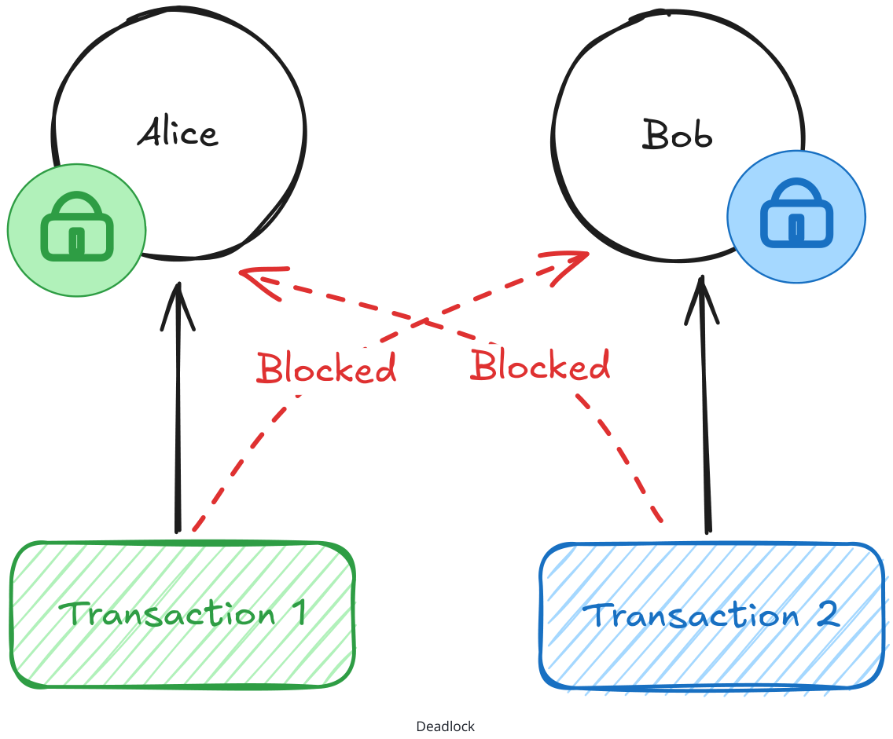
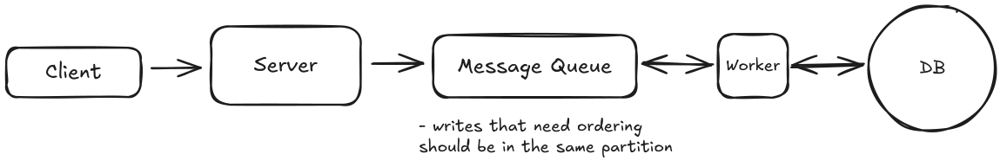

# Dealing with Contention

Learn about how to deal with high contention in your system design Dealing with Contention Updated Jun 4, 2026 🔒 Contention occurs when multiple processes compete for the same resource at the same time, like booking the last concert ticket or bidding on an auction item. Without proper handling, you get race conditions, double-bookings, and inconsistent state.

## The Race Condition

Consider buying concert tickets online. There's one seat left for The Weeknd, and Alice and Bob both want it. They each hit "Buy Now" in the same instant. The obvious way to handle a purchase is the one most of us would reach for first. Read the current seat count, check that it's above zero, and if it is, decrement it and sell the ticket.

```
-- Read the current count
SELECT available_seats FROM concerts WHERE concert_id = 'weeknd_tour';
-- The app checks available_seats > 0, then writes the new value back
UPDATE concerts SET available_seats = available_seats - 1 WHERE concert_id = 'weeknd_tour';
```

For a single buyer this is exactly right. The trouble starts when Alice and Bob run it at the same moment. Alice's request reads one seat available. A fraction of a millisecond later, before Alice has written anything back, Bob's request reads the same count and also sees one seat. Both check the number they just read, both conclude there's a seat to sell, and both move on to charge a card. Alice's update commits first and the count drops to zero. Bob's update commits right after, decrements again, and the count slides to negative one.

By the time the dust settles, both cards have been charged $500 and both buyers have a confirmation email for the same seat. Alice and Bob show up to the concert each thinking they own Row 5, Seat 12. One of them is getting kicked out, and the venue is stuck issuing a refund while dealing with two very angry customers.

```
interview.
```


**Figure 1: This diagram illustrates a race condition scenario where two users, Alice and Bob, attempt to purchase the last seat for a concert. Both read the seat count as 1 and proceed to decrement it, leading to a conflict where both decrement the count to 0, resulting in both transactions being successful but only one seat being sold. The timeline shows the sequence of events and the conflicting actions of Alice and Bob, highlighting the issue of concurrent access to the same resource.**

The real culprit is the gap between two steps the naive code treats as one. Reading the count and writing the new value back aren't a single action, and in between them the world can change. Bob slips into that gap, reads a seat count Alice is about to invalidate, and acts on a number that's already stale. The window is tiny, microseconds in memory and milliseconds over a network, but it's all it takes for both requests to decide they've won the same seat. The problem only gets worse when you scale. With 10,000 concurrent users hitting the same resource, even small race condition windows create massive conflicts. As you continue to grow, it's likely that you'll need to coordinate across multiple nodes which adds to the complexity. To get this right, we need some form of synchronization.

#### Problem Breakdowns with Dealing with Contention Pattern

[Ticketmaster](https://www.hellointerview.com/learn/system-design/problem-breakdowns/ticketmaster#dealing-with-contention)

[Online Auction](https://www.hellointerview.com/learn/system-design/problem-breakdowns/online-auction#dealing-with-contention)

## The Solution

The race condition from earlier has a name. It's a lost update , the classic failure of a read-modifywrite cycle. Two requests read the same value, both act on it, and both write back, so one silently overwrites the other. Every fix below is a way to close the gap between reading a value and acting on it. Underneath all of them is the same move, compare-and-set, where you read a value and make your write conditional on it not having changed in the meantime. We'll write the examples in SQL, but the same moves live in any serious datastore. We'll start with the simplest and add coordination only as each approach hits its limit.

[Rate Limiter](https://www.hellointerview.com/learn/system-design/problem-breakdowns/distributed-rate-limiter#dealing-with-contention)

[Online Chess](https://www.hellointerview.com/learn/system-design/problem-breakdowns/online-chess#dealing-with-contention)

### Conditional Writes

Start with the simplest case, because a lot of safety rules boil down to a simple if. You decrement the count if a seat is left, or mark the order shipped if it hasn't been cancelled. When your rule is an if about the current data, the database can check it and make the change in a single statement, no locks or version numbers required.

Booking a seat is exactly this kind of rule. "Decrement the count, but only if a seat is left." The whole thing fits in a single statement.

```
UPDATE concerts SET available_seats = available_seats - 1 WHERE concert_id = 'weeknd_tour' AND available_seats > 0;
```

Conveniently, this is already safe under concurrency. No matter how many people try to grab the last ticket at once, only one will succeed. The reason is that the database won't let two updates change the same row at the same time. It makes them take turns, and the one that has to wait doesn't get to act on the value it first read. Say Alice and Bob run this at the same instant. Alice's update goes first and takes the count from 1 to 0. Bob's waits for her to finish, re-checks available_seats > 0 against the row she left behind, finds it false, and matches zero rows. One seat, one sale. The check and the decrement are a single atomic step, so there's no gap for Bob to slip into.

One caveat for the curious. What the losing write does when it loses depends on your database's isolation level, which we get to later. At the common defaults it re-checks the condition and quietly matches zero rows, exactly as above. At stricter levels the database instead makes the loser abort with a serialization error that your app retries. Either way it's one seat, one sale. Only the failure shape changes.

A real purchase is more than a counter, though. You also have to create the ticket record, which means two writes that need to stick together. Decrement the seat but fail the insert and you've taken a seat off the board for a ticket that doesn't exist. This is what transactions are for. You wrap the operations in BEGIN and COMMIT , and the database treats them as one unit that either fully happens or fully rolls back.

Combining the two writes adds one trap worth knowing. When an UPDATE matches zero rows, meaning the WHERE clause found nothing to change, that's not an error. The statement succeeds, it just did nothing, so it won't fail the transaction or force a rollback. Run the INSERT unconditionally and Bob's failed decrement still creates a ticket for a seat he never got. The fix is to make the insert depend on whether the update actually changed anything.

```
BEGIN TRANSACTION;
WITH reservation AS (
UPDATE concerts SET available_seats = available_seats - 1 WHERE concert_id = 'weeknd_tour' AND available_seats > 0 RETURNING concert_id )
INSERT INTO tickets (user_id, concert_id, seat_number, purchase_time)
SELECT 'user123', concert_id, 'A15', NOW() FROM reservation;
COMMIT;
```

The UPDATE only returns a row when it actually changes one, and the INSERT ... SELECT draws its rows from that result. When the update matches nothing, the insert writes nothing. If you'd rather keep the logic in your application, check the affected row count after the update and roll back when it's zero. Either way, no ticket ends up without a seat behind it.

But look at what our guard actually protects. The WHERE clause guarantees a seat exists. It says nothing about which seat. Picture the same race with 20 seats left instead of 1. Alice and Bob both run the transaction, both decrements succeed because 20 and 19 are both greater than zero, and both inserts write a ticket for seat A15. The count is perfectly accurate and two people still own the same seat. The database did nothing wrong. We just never told it that A15 was a thing that could be contended.

The fix is to guard the resource people are actually fighting over. Give every ticket its own row, and aim the exact same conditional write at the ticket instead of the counter.

```
UPDATE tickets SET status = 'sold', user_id = 'user123' WHERE concert_id = 'weeknd_tour' AND seat_number = 'A15' AND status = 'available';
```

Now when Alice and Bob both go for A15, one of them flips the row to sold first, and the other's update matches zero rows because status = 'available' is no longer true. One ticket, one winner. The seat count becomes derived data you can compute from the ticket rows, or keep on the concert row as a cache and decrement in the same transaction.

The rule worth remembering is that the guard has to protect the thing being contended. A counter can answer "is there a ticket left." Only the ticket row can answer "is this ticket left."

This handles a big share of real contention, like decrementing a counter, flipping a status from available to sold, or claiming an unassigned row. As long as the database can evaluate your guard as part of the write, you're done, and you never reached for an explicit lock. The WHERE clause is just how SQL spells compare-and-set, the same move DynamoDB makes with a ConditionExpression , Redis with SET NX , Cassandra with a lightweight transaction, or an HTTP API with an If-Match header. But that's also the limit. The database can only enforce rules it can read in a WHERE clause, and plenty of real decisions can't be written that way.

### Pessimistic Locking

Say a group of four wants to sit together. Now picking the seats isn't a single decision the database can make for you. Your app has to read the seat map, find four open seats in a row, and only then claim them. That middle step is the whole problem. Finding a contiguous block is logic that runs in your application, not a predicate you can drop into a WHERE clause, so the read and the write can't collapse into one statement. Two groups both read the same map, both land on A15 through A18, and both move to claim it. In the gap between reading the map and writing the claim, the other group can take seats you'd already picked. We're right back to the lost update.

This is where explicit row locks earn their keep. Pessimistic locking prevents conflicts by acquiring locks upfront. The name comes from being "pessimistic" about conflicts, assuming they will happen and blocking them before they can.

```
BEGIN TRANSACTION;
-- Lock the open seats in this section while we pick a block
SELECT seat_number FROM seats WHERE concert_id = 'weeknd_tour' AND section = 'floor' AND status = 'available' FOR
UPDATE;
-- App scans the result, finds A15-A18 open and adjacent, then claims them
UPDATE seats SET status = 'sold', user_id = 'user123' WHERE concert_id = 'weeknd_tour' AND seat_number IN ('A15', 'A16', 'A17', 'A18');
COMMIT;
```

The FOR UPDATE clause locks every row the SELECT returns. While you pick a block, no other transaction can claim those seats, so a second group running the same query waits until you commit. By then A15 through A18 are sold, so they drop out of its results and it picks from what's left. One block each, no seat sold twice. The catch is that you've locked every open seat in the section just to claim four, so heavy booking traffic serializes here, which is part of what pushes you toward the optimistic approach next.

This is exactly what the bare conditional UPDATE couldn't give you. There, the check was a predicate the database could evaluate as it wrote, so a single statement did the whole job. Here the decision, which seats form an open block, runs in your application between the read and the write, and the database can't redo it inside a WHERE clause. So you lock the rows you read, decide while they're held still, and write before letting go. The same shape covers any read-decide-write where the decision isn't a predicate. Checking a balance against a daily limit before moving money, or reading stock across several items before claiming a bundle, both need the lock for the same reason. And if your logic ever simplifies back down to something a single WHERE clause can express, drop the lock and go back to the conditional UPDATE . Don't pay for a lock you don't need.

A lock in this context is a mechanism that prevents other database connections from accessing the same data until the lock is released. Databases like PostgreSQL and MySQL can handle thousands of concurrent connections, but locks ensure that only one connection can modify a specific row (or set of rows) at a time.


**Figure 2: This diagram illustrates the concept of explicit row locks in a database system. It shows three threads (Thread 1, Thread 2, and Thread 3) attempting to access database rows. Thread 1 successfully acquires a green lock on a database row, indicating it has exclusive access. Thread 2 and Thread 3 are blocked by red locks, signifying they cannot access the same row until Thread 1 releases its lock. This visual representation highlights how explicit row locks prevent concurrent access to the same data, ensuring data integrity and preventing conflicts in a multi-threaded environment.**

###### Common Failure Modes

The lock does its job in protecting resources from contention, but it comes with a price. There are two common mistakes that are worth looking out for.

- Locking too much, for too long. A lock only buys safety for the rows it covers and the time it's held, so keep both as small as you can. Lock an entire table and you serialize every writer behind one another, killing the concurrency you were trying to protect. Hold it for seconds instead of milliseconds and the buyers behind it pile up into a bottleneck. The worst offender is slow I/O. A payment API call inside the transaction leaves every other buyer of that concert waiting on a third party's latency, so do that work before you take the lock or after you release it. In our example, we scope the lock to the open seats in one section and release it the instant the block is claimed, so it never ripples out to the rest of the venue.
- Deadlocks from inconsistent ordering. Two transactions that grab the same rows in opposite orders will deadlock, each holding one lock and waiting forever on the other. Always acquire locks in a consistent order, like sorted by ID, so the cycle can't form. The database will detect the deadlock and kill one transaction, so treat the error as retryable. There's a full walkthrough in the deep dives below.

None of this is a reason to avoid pessimistic locking, but it does point at its real cost. Every transaction pays for the lock, including the overwhelming majority that were never going to collide with anyone. When two writers rarely touch the same row at the same moment, you're buying insurance against an event that almost never happens and paying the premium on every purchase.

### Optimistic Concurrency Control

Optimistic concurrency control (OCC) makes the opposite bet. It assumes conflicts are rare and detects them after the fact instead of blocking to prevent them. It's protecting the same gap between a read and a write, just without holding anything still. You let everyone proceed and catch the collision at write time. Under low contention, that skips the locking overhead entirely.

The mechanism is simpler than the name suggests. You need one value in the row that's guaranteed to change every time the row is written. Read the row and note that value. When you go to write, tell the database to apply the change only if the value is still what you read a moment ago. If someone slipped in ahead of you, they already changed it, so your WHERE matches nothing, your update touches zero rows, and that's your signal to retry. People call this value a version number , and the most common form is a dedicated integer you bump by one on every write. The only real requirement, though, is that the value changes whenever the row does. If you've ever used HTTP ETags, you've already shipped this exact idea. An If-Match header is a version check over the wire, where the server rejects your write with a 412 when the resource has moved since you read it. etcd does the same with a revision number, DynamoDB with a version attribute.

```
-- Both Alice and Bob read: 1 seat, version 42
-- Alice writes first:
BEGIN TRANSACTION;
UPDATE concerts SET available_seats = available_seats - 1, version = version + 1 WHERE concert_id = 'weeknd_tour' AND version = 42;
-- the version Alice read
INSERT INTO tickets (user_id, concert_id, seat_number, price, purchase_time) VALUES ('alice', 'weeknd_tour', 'A15', 750.00, NOW());
COMMIT;
-- Succeeds. seats = 0, version = 43
-- Bob writes against the version he read:
BEGIN TRANSACTION;
UPDATE concerts SET available_seats = available_seats - 1, version = version + 1 WHERE concert_id = 'weeknd_tour' AND version = 42;
-- stale, the row is on 43 now
-- Bob's
UPDATE matches 0 rows. Check the count, roll back, skip the insert.
ROLLBACK;
```

The same trap from the conditional write applies here. A stale version doesn't raise an error, it just updates zero rows, so your application has to check the affected count and roll back when it's zero. Otherwise the INSERT runs and you're back to a ticket with no seat. When Bob sees zero rows, he knows someone beat him to it. He can re-read the current state and retry with the fresh version, or tell the user the show sold out instead of failing in some mysterious way. That opens up a few options beyond a dedicated column. A last-updated timestamp can serve, as long as every write actually touches it and your clock resolution is fine enough that two quick updates never land on the same value. A business value you're already tracking can serve too, like the seat count in this example or the high bid in an auction. The catch with business values is the ABA problem, where a value changes from A to B and back to A and your check can't tell anything happened. If a bank balance goes from $100 to $50 and back to $100 between your read and write, the optimistic check passes even though the account changed meaningfully underneath you. So reuse a business value only when it moves in one direction, like an ever-increasing bid. When in doubt, a dedicated counter that only ever increments is the safe default. How often do writers actually collide? When collisions are common, lock upfront, because constant retries cost more than the lock ever did. When collisions are rare, which describes most ecommerce traffic, take the optimistic path and eat the occasional retry. Between conditional writes, locks, and versions, we can now protect any decision about a row. But all three tools share one blind spot. They protect rows that both transactions touch. There's a class of conflict where the transactions never touch the same row at all.

### Isolation Levels

Sometimes two transactions each read an overlapping set of rows, each makes a decision that's perfectly valid on its own, and only together do they break a rule. Because no single row collides, a conditional UPDATE , a row lock, and a version check all sail straight through. This is called write skew . Picture an on-call schedule with one rule, at least one engineer has to be on call at all times. Right now two are, Alice and Bob. Both come down with something and both try to step down at the same moment. Alice's transaction reads the schedule, sees Bob still on call, and decides it's fine to remove herself. Bob's transaction reads the same schedule, sees Alice still on call, and decides the exact same thing. Both commit. Now nobody is on call, even though neither transaction did anything wrong on its own.

Notice why the earlier tools can't help. Alice and Bob write to different rows, their own, so there's no shared row to lock, version, or guard with a WHERE clause. The conflict is in what they read to decide. You need the database to notice that both decisions leaned on data the other one changed.

That's what isolation levels are for. They control how much one transaction can see of another's in-flight work, and at the strict end they make the database track these read-write dependencies on your behalf. Most databases offer four standard levels (these are options, not a ladder you climb):

- READ UNCOMMITTED -Can see uncommitted changes from other transactions (rarely used)
- READ COMMITTED -Can only see committed changes (default in PostgreSQL)
- REPEATABLE READ -Same data read multiple times within a transaction stays consistent (default in MySQL)
- SERIALIZABLE -Strongest isolation, transactions appear to run one after another

None of the weaker levels catch write skew, REPEATABLE READ included. SERIALIZABLE is the one that does. It guarantees the result is the same as if the transactions had run one at a time, and the on-call double-resignation matches no such order. So the database won't let both commit. It stops one of them with an error, and your app retries. On the retry, that engineer reads the updated schedule, sees they'd be the last one out, and backs off.

```
BEGIN TRANSACTION ISOLATION LEVEL SERIALIZABLE;
-- Is anyone else on call right now?
SELECT count(*) FROM on_call WHERE team_id = 'payments' AND is_active = true;
-- App sees 2, decides it's safe to step down, then writes:
UPDATE on_call SET is_active = false WHERE engineer_id = 'alice';
COMMIT;
-- If Bob's transaction made the same decision concurrently,
-- one of the two commits aborts with a serialization error.
```


**Figure 3: This diagram compares the execution order of transactions under two isolation levels: Read Committed and Serializable. The top section illustrates the Read Committed level, where transactions can read data that has been committed by other transactions, potentially leading to read skew. The bottom section shows the Serializable level, where transactions are executed in a strict order, ensuring that the result is the same as if the transactions had run one at a time, thus preventing write skew and ensuring data consistency.**

The problem is SERIALIZABLE isn't free. It makes the database track all the reads and writes it needs to find these conflicts, and every abort throws away work that has to be redone, so it's the most expensive option on the menu. It can handle the gaps from earlier too, but pessimistic locking or OCC get you there more cheaply, so save SERIALIZABLE for when the conflict genuinely spans rows. Isolation levels are also a relational-database feature. Most NoSQL and distributed stores don't give you true SERIALIZABLE , so on those the only real option is the cheaper one anyway, folding the invariant onto a single cell you can guard directly.

And when you can, it's often cheaper still to materialize the conflict onto a single row it can land on. A count on the team row, or a FOR UPDATE lock on that row before anyone steps down, turns a cross-row invariant back into the same-row contention the earlier tools handle well. It's the same lesson the seat example taught us earlier, where giving each seat its own row was the only way the database could tell two buyers of A15 apart. The database can only protect a conflict it can see, and your job in all of this is to make sure the contended thing exists as a single addressable cell, a row, a key, or an item the store can check as it writes.

### Distributed Locks

Notice that every tool so far lives inside a single database transaction, and a database lock only lasts as long as the transaction holding it. That's fine when the protected work is a quick read-decidewrite. But sometimes you need to hold exclusive access across something a transaction can't span.

Ticketmaster is the classic case. You pick seat A15 and the app holds it for you for ten minutes while you fill out your payment details. A FOR UPDATE lock can't do this. It would pin a connection for the full ten minutes and stall any other transaction that needs the row, and it lives only inside the transaction that took it, so your other stateless web servers can't see it. The fix is to stop holding the lock as a transaction and start holding it as data, a record of who holds the seat and when their hold expires, that any server can read and that outlives any single transaction.

That's a distributed lock. It's the same locking idea from the earlier rungs, just held as a lease with its own lifetime instead of a transaction-scoped lock, and you reach for it any time exclusive access has to span multiple steps, a call to another service, or a wait. The real question is where that lease lives, and each option trades off speed, infrastructure, and how gracefully it handles failure:

Redis with TTL -Redis gives you atomic operations with automatic expiration, which makes it a great fit for a reservation lock. The SET command with NX (only set if not exists) and a TTL atomically creates a lock that Redis clears on its own when the TTL passes (the NX flag is critical, without it a second process could overwrite an existing lock). No cleanup job, and any web server can check the same key. The advantage is speed and simplicity. The catch is that a TTL lock isn't an airtight guarantee of exclusivity. If the holder stalls past its TTL, say a long GC pause or a slow network, Redis hands the lock to the next caller and for a moment two clients think they hold it. For a soft reservation like a seat hold that's a rare, harmless hiccup, but it's the reason you don't lean on a plain TTL lock when a double-grant would corrupt data. Redis is also a single point of failure to plan around.

Database columns -If you're already on a database, a lock is just two columns on the row, one for who holds it and one for when the hold expires. Acquiring it is the same conditional write from earlier, claiming the row only if it's free or the previous hold has lapsed.

```
UPDATE seats SET reserved_by = 'user123', reserved_until = NOW() + INTERVAL '10 minutes' WHERE seat_id = 'A15' AND (reserved_until IS NULL OR reserved_until < NOW());
```

One row updated means you got the hold, zero means someone else has it. Because expiry lives right in the WHERE clause, a lapsed hold counts as free and no cleanup job is needed to make it correct. The advantage is no new infrastructure and the same consistency as the rest of your data. The disadvantage is that database writes are slower than a cache, and the lock row itself becomes a contention point under heavy load.

ZooKeeper /etcd -These are purpose-built coordination services designed specifically for distributed systems. They provide strong consistency guarantees even during network partitions and leader failures. ZooKeeper uses ephemeral nodes that automatically disappear when the client session ends, providing natural cleanup for crashed processes. Both systems use consensus algorithms (Raft for etcd, ZAB for ZooKeeper) to maintain consistency across multiple nodes.

The advantage is robustness. These systems are designed to handle the complex failure scenarios that Redis and database approaches struggle with. The disadvantage is operational complexity, as you need to run and maintain a separate coordination cluster.

Holding the seat in a reserved state like this is as much a UX win as a correctness one. It shrinks the window where two people can fight over the seat from the whole checkout down to the instant of selection, so nobody fills out payment only to be told the seat is gone.

Each rung shows up the same way in other stores.

| Rung                   | In SQL                                  | The same move elsewhere                                                                        |
|------------------------|-----------------------------------------|------------------------------------------------------------------------------------------------|
| Conditional write      | WHERE predicate on the write            | DynamoDB ConditionExpression , Redis SET NX , Cassandra lightweight transaction, HTTP If-Match |
| Optimistic concurrency | version column with WHERE version = ... | HTTP ETags / If-Match , etcd revision, DynamoDB version attribute                              |
| Pessimistic locking    | SELECT ... FOR UPDATE                   | a mutex or a distributed lock held while you decide                                            |
| Serializable isolation | ISOLATION LEVEL SERIALIZABLE            | mostly relational only, so elsewhere you fold the invariant onto one cell                      |
| Distributed lock       | reservation row with a TTL              | Redis SET NX EX , ZooKeeper or etcd lease                                                      |

Notice every technique here aims at one authoritative home for the contended resource. That's the whole game, so fight to keep it that way. If you need strong consistency under high contention, do everything you can to keep the relevant data in a single database first. Nine times out of ten that's possible. Two situations genuinely break the single-home assumption, and both live outside this pattern. If one operation must atomically span multiple services or shards (like a transfer between two sharded accounts), that's a distributed transaction, covered in Multi-step Processes . And if the same record is writable in multiple places at once (multi-leader or leaderless replication), there's no single home to defend, and you're into conflict resolution like last-write-wins, vector clocks, or CRDTs, which is a replication topic beyond our scope here.

## Choosing the Right Approach

Like with much of system design, there isn't always a clear-cut answer. You'll need to consider the tradeoffs of each approach based on your specific use case and make the appropriate justification for your choice.

The right tool comes down to the shape of the write you're protecting. Walk down the list and take the first one that fits. Your check is a predicate on the row you're writing: Use a conditional UPDATE and gate any follow-up work on the affected row count, whether that's a counter decrement, a status flip, or claiming a row. No explicit lock needed since the write is atomic on its own. It's the simplest thing that works, so reach for it first. You have to read, decide in application code, then write: The check isn't something a WHERE clause can express, like finding an open block of seats or checking a value on another row. Pessimistic locking with FOR UPDATE holds the rows you read across the gap, and it's predictable and easy to reason about. A good default when contention is high. Same read-decide-write, but collisions are rare: Optimistic concurrency. Tag the row with a value that changes on every write, a version counter, a timestamp, or a business value that only moves one way, and retry when your write finds it already moved. Better performance and no blocking when conflicts are infrequent. Your invariant spans rows that never collide: This is write skew, and the simpler tools miss it because there's no shared row to lock or guard. Reach for SERIALIZABLE isolation so the database catches the conflict, or materialize the invariant onto a single row you can lock. The hold has to outlive a single transaction: A distributed lock, for when exclusivity has to span a wait, a call to another service, or several steps, like reserving a seat during checkout. It's also the move for user-facing competitive flows, where a short reservation is as much about UX as correctness.

| Approach                                                                         | Use When                                                     | Avoid When                                   | Typical Latency   | Complexity             |
|----------------------------------------------------------------------------------|--------------------------------------------------------------|----------------------------------------------|-------------------|------------------------|
| Your check is a predicate on the row you're writing (counter, status, claim)     | The decision needs app logic or spans other rows             | Low (one atomic statement)                   | Low               | Conditional Write      |
| Read-decide-write where the check isn't a WHERE predicate; high contention       | Low contention, or a conditional write already covers it     | Low per op, but holds a lock others wait on  | Low               | Pessimistic Locking    |
| Same read-decide-write, but collisions are rare; high read/write ratio           | High contention where retries pile up                        | Low when no conflict, retry cost on conflict | Medium            | Optimistic Concurrency |
| Write skew or a cross- row invariant with no single row to lock                  | Hot, high- contention paths (abort/retry cost)               | Medium (conflict tracking)                   | Medium            | SERIALIZABLE Isolation |
| Exclusivity must span a wait, an external call, or multiple steps (reservations) | A single-row guard inside one transaction already handles it | Low (simple status writes)                   | Medium            | Distributed Locks      |

When in doubt, keep it in a single database and reach for the simplest tool that fits. A conditional UPDATE if your check is a predicate, pessimistic locking once you've got real readdecide-write logic. You can always tighten it later.

## When to Use in Interviews

Don't wait for the interviewer to ask about contention. When you see scenarios where multiple processes compete for the same resource, call it out and suggest coordination mechanisms. This is typically when you determine during your non-functional requirements that your system requires strong consistency.

### Recognition Signals

Here are some bang on examples of when you might need to use contention patterns:

Multiple users competing for limited resources such as concert tickets, auction bidding, flash sale inventory, or matching drivers with riders Prevent double-booking or double-charging in scenarios like payment processing, seat reservations, or meeting room scheduling Ensure data consistency under high concurrency for operations like account balance updates, inventory management, or collaborative editing Handle race conditions in distributed systems in any scenario where the same operation might happen simultaneously across multiple servers and where the outcome is sensitive to the order of operations.

### Common Interview Scenarios

This shows up A LOT in common interview questions. It's one of the most popular patterns and interviewers love to ask about it. Online Auction Systems -Perfect for demonstrating optimistic concurrency control because multiple bidders compete for the same item. You can use the current high bid as the "version" (since bids only go up, no ABA risk) and only accept new bids if they're higher than the expected current bid.

Ticketmaster/Event Booking -While this seems like a classic pessimistic locking scenario for seat selection, temporary reservations are actually the bigger win. When users select seats, you immediately reserve them with a 10-minute TTL using a distributed lock, which prevents the terrible UX of users filling out payment info only to find the seat was taken by someone else.

Banking/Payment Systems -When the money movement stays within a single database, this is a pessimistic-locking or OCC problem and lives right here. Once a transfer has to span multiple services or shards, it stops being a contention problem and becomes a distributed-transaction one, which we cover in Multi-step Processes .

Ride Sharing Dispatch -Temporary status reservations shine here. You can set driver status to "pending_request" when sending ride requests, which prevents multiple simultaneous requests to the same driver. Use either a cache with TTL for automatic cleanup when drivers don't respond system within 10 seconds, or a status column with an expiration timestamp, where a request that's gone stale reads as free without any cleanup job. Flash Sale/Inventory Systems -Perfect for demonstrating a mix of approaches. You can use optimistic concurrency with a dedicated version column for inventory updates, combined with temporary cart "holds" (using distributed locks with TTL) to improve user experience and reduce contention at checkout. Yelp/Review Systems -A good example of optimistic concurrency control. When users submit reviews, you need to update the business's average rating. Multiple concurrent reviews for the same restaurant create contention, so you can use a dedicated version column and only update if the version matches what you read. This prevents rating calculations from getting corrupted when reviews arrive simultaneously. The best candidates identify contention problems before they're asked. When designing any with shared resources, immediately address coordination: "This auction system will have multiple bidders competing for items, so I'll use optimistic concurrency control with the current high bid as my version check." "For the ticketing system, I want to avoid users losing seats after filling out payment info, so I'll implement seat reservations with a 10-minute timeout."

### When NOT to overcomplicate

Don't reach for complex coordination mechanisms when simpler solutions work.

A common mistake I see is candidates reaching for distributed locks (Redis, etc) when a simple database transaction with row locking or OCC is sufficient. Adding new components adds system complexity and introduces new failure modes so do what you can to avoid them.

Low contention scenarios where conflicts are rare (like updating product descriptions where only admins can edit) can use basic optimistic concurrency with retry logic. Don't implement elaborate locking schemes when simple retry logic handles the occasional conflict.

Single-user operations like personal todo lists, private documents, or user preferences have no contention, so no coordination is needed.

Read-heavy workloads where most operations are reads with occasional writes can use simple optimistic concurrency to handle the rare write conflicts without impacting read performance.

## Common Deep Dives

Interviewers love to dig into edge cases and failure scenarios.

### "How do you prevent deadlocks with pessimistic locking?"

Consider a bank transfer between two accounts. Alice wants to transfer $100 to Bob, while Bob simultaneously wants to transfer $50 to Alice. Transaction A needs to debit Alice's account and credit Bob's account. Transaction B needs to debit Bob's account and credit Alice's account. Transaction A locks Alice's account first, then tries to lock Bob's account. Transaction B locks Bob's account first, then tries to lock Alice's account. Both transactions wait forever for the other to release their lock.

##### Deadlock!


**Figure 4: This diagram illustrates a deadlock scenario where two transactions, Transaction 1 and Transaction 2, are blocked due to circular waiting. Alice, represented by the green lock, has a transaction that is blocked by Bob, represented by the blue lock. Similarly, Bob's transaction is blocked by Alice. The dashed arrows indicate the blocked state, highlighting the circular dependency that leads to the deadlock. This visualization helps in understanding the concept of deadlock and the importance of ordered locking to prevent such scenarios.**

This deadlock happens because the transactions acquire locks in different orders. The business logic doesn't care about order, it just wants to update both users when they interact. But databases can't read your mind about which locks are safe to acquire simultaneously.

The standard solution is ordered locking, which means always acquiring locks in a consistent order regardless of your business logic flow. Sort all the resources you need to lock by some deterministic key (like user ID or database primary key) before acquiring any locks. If you need to lock users 123 and 456, always lock 123 first even if your business logic processes 456 first. This prevents circular waiting because all transactions follow the same acquisition order.

For a transfer between users 456 and 123, always lock user 123 first regardless of who initiated the transfer. This is critical. You must sort all participants by the same key, not "lock the initiator first." If Alice (ID 456) transfers to Bob (ID 123), lock Bob first because 123 < 456. If Bob transfers to Alice, still lock Bob first. The exact ordering scheme doesn't matter as long as it's globally consistent across all transactions in your system.

Even with ordered locking, treat a deadlock as something you handle, not something you've ruled out. Every major database runs automatic deadlock detection: when it spots a cycle, it aborts one of the transactions with a deadlock error and lets the other proceed. It's on by default, so the real work is catching that error and retrying the loser with its locks taken in order. A lock-wait timeout is a coarser backstop for a different case, a transaction stuck behind a lock that's simply held too long rather than a true cycle. So lean on ordered locking to prevent deadlocks, and on the database's detector to clean up the ones that slip through.

### "How do you handle the ABA problem with optimistic concurrency?"

This is a sneaky question that tests deeper understanding. The ABA problem occurs when a value changes from A to B and back to A between your read and write. Your optimistic check sees the same value and assumes nothing changed, but important state transitions happened.

Say each restaurant tracks a review_count and you reuse it as your version. You read it at 100. Between your read and your write, one review is deleted (dropping it to 99) and a new one lands (bringing it back to 100). Your write checks "is the version still 100?", sees yes, and commits, silently clobbering the update that happened in between. The count went A → B → A, and an equality check can't see the round trip.

The safest solution is a dedicated version column that increments on every update, regardless of whether any business data changed. Your update becomes "set new average and increment version, but only if the version matches what I read."

```
-- Use a dedicated version column for safety
UPDATE restaurants SET avg_rating = 4.1, review_count = review_count + 1, version = version + 1 WHERE restaurant_id = 'pizza_palace' AND version = 42;
-- Expected current version
```

If you can't add a version column, the fallback is to put every field you read into the WHERE clause so the write only applies when the whole row still matches what you saw. It's heavier and clunkier, but it catches any change, including the round trip a lone business value would hide. Some databases also expose a built-in row version, like Postgres's system xmin column, that you can use instead of maintaining your own.

### "What about performance when everyone wants the same resource?"

This is the hot partition or celebrity problem, where your carefully designed distributed system suddenly has everyone hammering the same single resource. Think about what happens when a celebrity joins Twitter and millions of users try to follow them simultaneously, or when a rare collectible drops on eBay and thousands of people bid on the same item, or when Taylor Swift announces a surprise concert and everyone tries to buy tickets at the exact same time. The fundamental issue is that normal scaling strategies break down when the contention lands on one specific item. Sharding splits load across rows, but everyone here wants the same row, so there's nothing to split. Load balancing just spreads the requests across servers that then queue up on that same row. Read replicas take read load off the primary, but the fight here is over writes, so they don't touch it. Your first strategy should be questioning whether you can change the problem itself rather than throwing more infrastructure at it. Maybe instead of one auction item, you actually have 10 identical items and can run separate auctions for each. Maybe instead of requiring immediate consistency for social media interactions, you can make likes and follows eventually consistent -users won't


**Figure 5: This diagram illustrates the architecture of a queue-based serialization system designed to handle contention issues in distributed systems. It shows a client sending requests to a server, which then routes these requests to a message queue. The queue acts as a buffer, managing traffic spikes and ensuring that all requests for a specific resource are processed sequentially by a worker thread. The worker thread then interacts with the database (DB) to perform the necessary operations, ensuring that writes that need ordering are processed in the same partition to maintain consistency. This setup transforms a contention problem into a serial one, improving system reliability at the cost of throughput.**

notice if their follow takes a few seconds to appear on the celebrity's follower count. Queue-Based Serialization For cases where you truly need strong consistency on a hot resource, implement queue-based serialization. Put all requests for that specific resource into a dedicated queue that gets processed by a single worker thread. This eliminates contention entirely by making operations sequential Client Server Message Queue Worker DB - writes that need ordering should be in the same partition rather than concurrent. The queue acts as a buffer that can absorb traffic spikes while the worker processes requests at a sustainable rate.

The tradeoff is throughput, not just latency. One worker can only process so fast, and it's a single point of failure you'd back with a standby. You've turned a contention problem into a serial one, which is often the better deal when the alternative is the whole system grinding to a halt, but you've capped how fast that resource can ever go.

## Conclusion

Contention handling matters for reliable systems, but the core idea is simpler than most engineers expect. Every contended resource has a single source of truth, the one place that owns the real value, and that's where correctness gets enforced. Conditional writes, pessimistic locking, isolation levels, and optimistic concurrency are just different ways of coordinating access at that source of truth, escalating as the gap you have to protect grows. And when that gap finally outgrows a single transaction, stretching across a wait or a call to another system, a distributed lock holds the exclusivity. They protect access to the source of truth rather than replacing it.

That framing keeps you out of trouble. Pessimistic locking handles high contention predictably, optimistic concurrency delivers excellent performance when conflicts are rare, and a modern database like PostgreSQL can absorb far more contention at a single source of truth than people assume. Reach for external locks and reservations when traffic or user experience demands it, not by default. And the first move is always to make sure the contended thing actually exists as a single cell the store can guard, whether that's a row, a key, or an item, depending on where it lives.

Keep the boundary clear too. The moment an operation has to span multiple sources of truth, you've left contention behind and entered distributed-transaction territory. The simplest solution that works at the source of truth is almost always the right one.