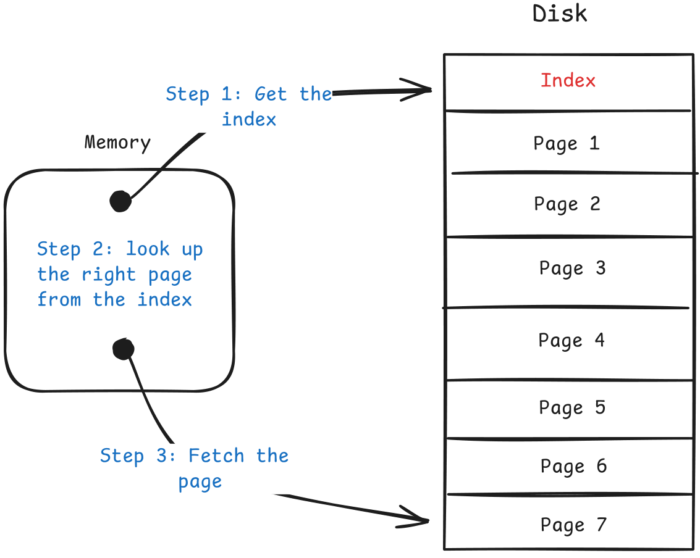
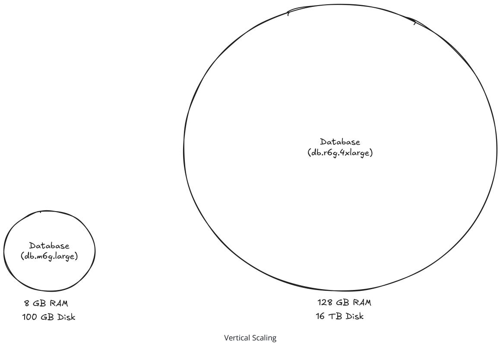
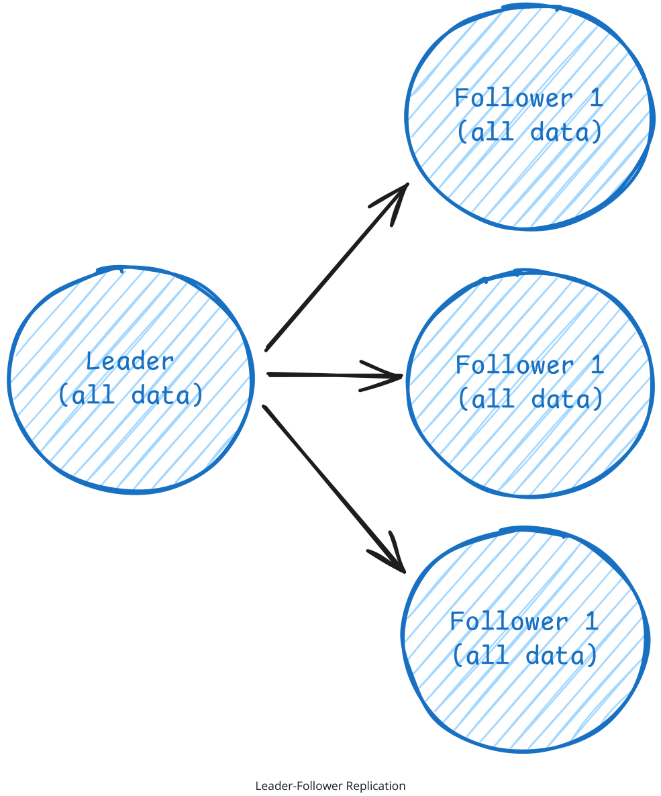
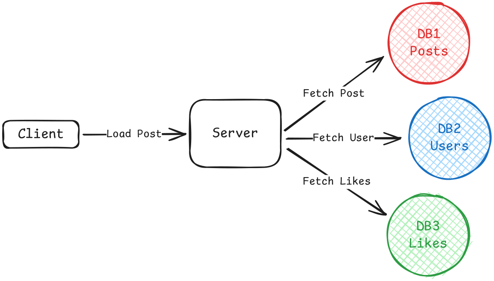
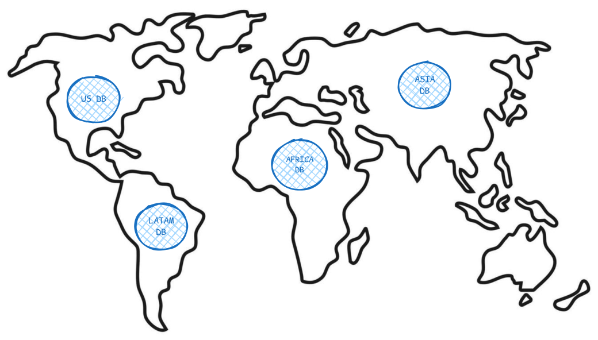
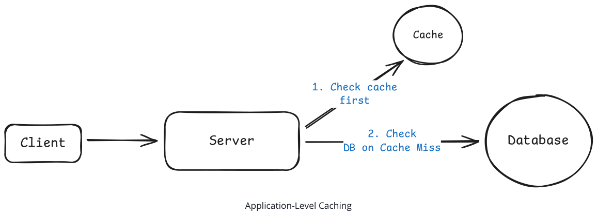
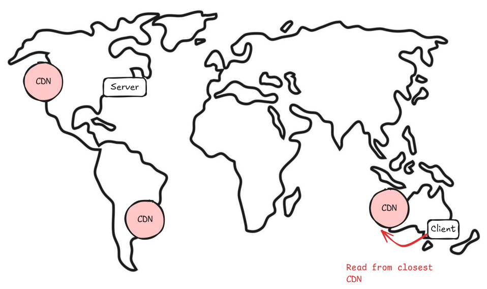

##### Patterns

# Scaling Reads

Learn about how to scale reads in your system design interview.

📖 Scaling Reads addresses the challenge of serving high-volume read requests when your application grows from hundreds to millions of users. While writes create data, reads consume it -and read traffic often grows faster than write traffic. This pattern covers the architectural strategies to handle massive read loads without crushing your primary database.

## The Problem

Consider an Instagram feed. When you open the app, you're immediately hit with dozens of photos, each requiring multiple database queries to fetch the image metadata, user information, like counts, and comment previews. That's potentially 100+ read operations just to load your feed. Meanwhile, you might only post one photo per day -a single write operation.

This imbalance is incredibly common. For every tweet posted, thousands of users read it. For every product uploaded to Amazon, hundreds browse it. Similarly, YouTube serves billions of video views daily but only millions of uploads. The standard read-to-write ratio starts at 10:1 but often reaches 100:1 or higher for content-heavy applications. As the number of reads increase, your database will struggle under the load. More often than not, this isn't a software problem you can debug your way out of -it's physics. CPU cores can only execute so many instructions per second, memory can only hold so much data, and disk I/O is bounded by the speed of spinning platters or SSD write cycles. When you hit these physical constraints, throwing more code at the problem won't help. So, what is the solution? Let's break it down.

##### Problem Breakdowns with Scaling Reads Pattern

| Ticketmaster           | Bitly           |
|------------------------|-----------------|
| Instagram              | FB News Feed    |
| YouTube Top K          | Yelp            |
| Distributed Cache      | Rate Limiter    |
| YouTube                | FB Post Search  |
| Local Delivery Service | News Aggregator |
| Metrics Monitoring     |                 |

## The Solution

Read scaling follows a natural progression from simple optimization to complex distributed systems.

1. Optimize read performance within your database
2. Scale your database horizontally
3. Add external caching layers

Here's how each works.

### Optimize Within Your Database

Before adding more infrastructure, there is typically plenty of headroom in your existing database. Most read scaling problems can be solved with proper tuning and smart data modeling.

#### Indexing

An index is essentially a sorted lookup table that points to rows in your actual data. Think of it like a book index -instead of scanning every page to find mentions of "database," you check the index at the back which tells you exactly which pages to look at. When you query without an index, the database performs what's called a full table scan, it reads every single row to find matches. With an index, it can jump directly to the relevant rows. This turns a linear O(n) operation into a logarithmic O(log n) operation, which is the difference between scanning 1 million rows versus checking maybe 20 index entries.


**Figure 1: This diagram illustrates the three-step process of using a database index: (1) Retrieving the index from memory, (2) Locating the correct page within the index, and (3) Fetching the page from the disk. The visual representation helps clarify how indexes speed up data retrieval by reducing the need to scan through entire datasets.**

There are different types of indexes, with B-tree being the most common for general queries. Hash indexes work well for exact matches, while specialized indexes handle full-text search or geographic queries. If you want to know more about index types and when to use them, we cover that in our database indexing deep dive .

The first thing you should consider when addressing a read scaling problem is to add indexes to the columns you frequently query, join on, or sort by. For example, if you're designing a social media app and users often search for posts by hashtag, index the hashtag column. If you're sorting products by price, index the price column.

You'll read outdated resources warning about "too many indexes" slowing down writes. While index overhead is real, this fear is dramatically overblown in most applications. Modern hardware and database engines handle well-designed indexes efficiently. In interviews, confidently add indexes for your query patterns -under-indexing kills more applications than over-indexing ever will.

#### Hardware Upgrades

Sometimes the answer is just better hardware. Boring, but effective. Swapping spinning disks for SSDs can give you 10-100x faster random I/O. Adding more RAM means more of your dataset sits in memory instead of on disk. And faster CPUs and more cores mean you can handle more concurrent queries without breaking a sweat.


**Figure 2: This image illustrates the concept of vertical scaling in database management, comparing two different database instances. The smaller circle represents a database with 8 GB of RAM and 100 GB of disk space, labeled as 'db.m6g.large'. The larger circle represents a database with 128 GB of RAM and 16 TB of disk space, labeled as 'db.r6g.4xlarge'. The size difference visually emphasizes the significant increase in resources available in the larger database, suggesting a more powerful and scalable solution.**

This won't solve every problem, but it's often the fastest way to buy yourself some breathing room.

It doesn't hurt to mention that you'd consider scaling hardware, though this is rarely what the interviewer is looking for, as it sort of sidesteps the question.

#### Denormalization Strategies

Another technique is to better organize data within your single database. Normalization is the process of structuring data to reduce redundancy by splitting information across multiple tables to avoid storing duplicate data. While this saves storage space, it makes queries more complex because you need joins to bring related data back together.

Consider a typical e-commerce database. In a normalized design, you might have separate tables for users, orders, and products. To display an order summary, you'd join all three tables:

```
JOIN orders o ON u.id = o.user_id JOIN order_items oi ON o.id = oi.order_id JOIN products p ON oi.product_id = p.id WHERE o.id = 12345;
```

This join across multiple tables gets expensive when you're serving thousands of order pages per second. The database has to look up data across different tables, match foreign keys, and combine results.

For read-heavy systems, denormalization (the opposite of normalization where you store redundant data) trades storage for speed. Instead of joining three tables to get user profile data, store the data redundantly in a single table.

In our denormalized version, we might create an order_summary table that duplicates user names, product names, and prices alongside order data. Now fetching an order summary becomes a simple single-table query:

```
SELECT user_name, order_date, product_name, price FROM order_summary WHERE order_id = 12345;
```

Yes, you're storing the same user name in multiple places if they have multiple orders. But for a read-heavy system, this storage cost could be worth the query speed improvement.

###### Normalized

User Table

| Evan   | Seattle     | 3-10-25   |
|--------|-------------|-----------|
| Stefan | Seattle     | 4-04-25   |
| Shivam | Los Angeles | 1-14-24   |
| Glenn  | San Fran    | 12-25-24  |

###### Denormalized

Orders Denormalization

| Table   | 1   | {name: Evan, location: Seattle, date: 3-20-25}   | {product: Table, cost: $100}   |
|---------|-----|--------------------------------------------------|--------------------------------|

For systems that read data far more often than they write it, optimizing for read performance makes sense even if it complicates writes. You'll need to update multiple places when a user changes their name, but that happens rarely compared to viewing orders.

Denormalization is a classic example of optimizing for reads at the expense of writes. Storing duplicate data makes reads faster but writes more complex given you must update multiple locations. Always consider your read/write ratio before denormalizing. If writes are frequent, the complexity may not be worth it.

Materialized views take this further by precomputing expensive aggregations. Instead of calculating average product ratings on every page load, compute them once (via a background job) and store the results. This is especially powerful for analytics queries that involve complex calculations across large datasets.

```
-- Instead of this expensive query on every page load:
SELECT p.id, AVG(r.rating) as avg_rating FROM products p
```

| Order     | Table       |     |
|-----------|-------------|-----|
| Evan Evan | Table Chair | 1 4 |
| Evan      | Lamp        | 1   |
| Glenn     | Lamp        | 2   |

| Product Table   | Product Table   |
|-----------------|-----------------|
| Table           | $100            |
| Chair           | $50             |
| Lamp            | $70             |

```
JOIN reviews r ON p.id = r.product_id GROUP BY p.id;
-- Precompute and store the average:
CREATE MATERIALIZED VIEW product_ratings AS
SELECT p.id, AVG(r.rating) as avg_rating FROM products p JOIN reviews r ON p.id = r.product_id GROUP BY p.id;
```

### Scale Your Database Horizontally

When a single database server hits its limits, add more servers. This is where things get interesting -and complex. We go into detail in our Numbers to Know Deep Dive , but a general rule of thumb is that your DB will need to scale horizontally (or add a cache -more on that later) when you exceed 50,000-100,000 read requests per second (assuming you already have proper indexing).

This is a very rough estimate. The actual number will depend on your application's read patterns, data model, hardware, and more. That said, in an interview, rough estimates are usually more than enough to justify your decision.

#### Read Replicas

The first approach to scaling beyond a single database is adding read replicas. Read replicas copy data from your primary database to additional servers. All writes go to the primary, but reads can go to any replica. This distributes read load across multiple servers.

Beyond solving the throughput problem, read replicas also provide redundancy as a nice added benefit. If your primary database fails, you can promote a replica to become the new primary, minimizing downtime.

Leader-follower replication is the standard approach. One primary (leader) handles writes, multiple secondaries (followers) handle reads. Replication can be synchronous (slower but consistent) or asynchronous (faster but potentially stale).

###### - Can propogate writes from leader to follower async or sync (for strong consistency)


**Figure 3: This diagram illustrates the concept of leader-follower replication in distributed systems. The leader node, which holds all data, is at the center and is responsible for managing the replication process. Arrows indicate the direction of data propagation to three follower nodes, each of which also holds all data. This setup highlights the asynchronous nature of the replication process, where the leader node sends updates to the followers, ensuring that all nodes eventually have the same data, though with potential replication lag.**

The key challenge is replication lag. When you write to the primary, it takes time to propagate to replicas. Users might not see their own changes immediately if they're reading from a lagging replica.

Replication lag is a common interview question. You need to understand the trade-offs between synchronous and asynchronous replication. Synchronous replication ensures data consistency but introduces latency. Asynchronous replication is faster but introduces potential data inconsistencies.

#### Database Sharding

Read replicas distribute load but don't reduce the dataset size that each database needs to handle. If your dataset becomes so large that even well-indexed queries are slow, database sharding can help by splitting data across multiple databases. For read scaling, sharding helps in two main ways: smaller datasets mean faster individual queries, and you can distribute read load across multiple databases. Functional sharding splits data by business domain or feature rather than by records. Put user in one database, product data in another. Now user profile requests only query the smaller user data database, and product searches only hit the product database.


**Figure 4: This diagram illustrates the concept of functional sharding in a database system. It shows a client sending a 'Load Post' request to a server, which then fetches data from three separate databases: DB1 for posts, DB2 for user data, and DB3 for likes. This setup allows for efficient retrieval of specific types of data, improving query performance and reducing the load on individual databases.**

Geographic sharding is particularly effective for global read scaling. Store US user data in US databases, European data in European databases. Users get faster reads from nearby servers while reducing load on any single database.


**Figure 5: This image illustrates geographic sharding, where databases are distributed across different regions to optimize read scalability. The world map is divided into four regions (US, LATAM, Africa, Asia) each containing a database labeled with its respective region. This setup ensures that users in each region can access their data more efficiently from nearby servers, thereby reducing load on any single database and improving overall read performance.**

However, sharding adds significant operational complexity and is primarily a write scaling technique. For most read scaling problems, adding caching layers is more effective and easier to implement.

### Add External Caching Layers

When you've optimized your database but still need more read performance, you have two main options: add read replicas (as discussed above) or add caching. Both distribute read load, but caches typically provide better performance for read-heavy workloads. Importantly, most applications exhibit highly skewed access patterns. On Twitter, millions read the same viral tweets. On e-commerce sites, thousands view the same popular products. This means you're repeatedly querying your database for identical data -data that rarely changes between requests. Caches exploit this pattern by storing frequently accessed data in memory. While databases need to read from disk and execute queries, caches serve pre-computed results directly from RAM. This difference translates to sub-millisecond response times versus tens of milliseconds for even welloptimized database queries.

#### Application-Level Caching

In-memory caches like Redis or Memcached sit between your application and database. When your application needs data, it checks the cache first. On a hit, you get sub-millisecond response times. On a miss, you query the database and populate the cache for future requests.


**Figure 6: This diagram illustrates the process of application-level caching. It shows a client sending a request to a server, which first checks the cache. If the data is found in the cache (a hit), the server returns it immediately. If the data is not found in the cache (a miss), the server then queries the database and populates the cache for future requests. This flow is crucial for optimizing response times and managing data access in distributed systems.**

This pattern works because popular data naturally stays in cache while less frequently accessed data falls back to the database. Celebrity profiles remain cached continuously due to constant access. Inactive user profiles get cached only when accessed, then expire after the TTL. Cache invalidation remains the primary challenge. When data changes, you need to ensure caches don't serve stale data. Common strategies include:

1. Time-based expiration (TTL) -Set a fixed lifetime for cached entries. Simple to implement but means serving potentially stale data until expiration. Works well for data with predictable update patterns.
2. Write-through invalidation -Update or delete cache entries immediately when writing to the database. Ensures consistency but adds latency to write operations and requires careful error handling.
3. Write-behind invalidation -Queue invalidation events to process asynchronously. Reduces write latency but introduces a window where stale data might be served.
4. Tagged invalidation -Associate cache entries with tags (e.g., "user:123:posts"). Invalidate all entries with a specific tag when related data changes. Powerful for complex dependencies but requires maintaining tag relationships.
5. Versioned keys -Include version numbers in cache keys. Increment the version on updates, naturally invalidating old cache entries. Simple and reliable but requires version tracking.

Most production systems combine approaches. Use short TTLs (5-15 minutes) as a safety net, with active invalidation for critical data like user profiles or inventory counts. Less critical data like recommendation scores might rely solely on TTL expiration.

Ideally, your cache TTL should be driven by non-functional requirements around data staleness. If your requirements state "search results should be no more than 30 seconds stale," that gives you your exact TTL. For user profiles that can tolerate 5 minutes of staleness, use a 5-minute TTL. This bounds your consistency guarantees and makes cache strategy decisions straightforward.

#### CDN And Edge Caching

Content Delivery Networks extend caching beyond your data center to global edge locations. While originally designed for static assets, modern CDNs cache dynamic content including API responses and database query results.


**Figure 7: This diagram illustrates the concept of Content Delivery Networks (CDNs) caching content at edge locations around the world. It shows a simplified world map with three CDN nodes (labeled as 'CDN') strategically placed in different continents. The 'Server' is depicted as a central point, and the 'Client' is shown in Asia, with an arrow indicating that the client should read from the closest CDN to reduce latency and improve response times. This visual effectively conveys the idea of distributing content closer to users to enhance performance and reduce load on origin servers.**

Geographic distribution provides dramatic latency improvements. A user in Tokyo gets cached data from a Tokyo edge server rather than making a round trip to your Virginia data center. This reduces response times from 200ms to under 10ms while completely eliminating load on your origin servers for cached requests. For read-heavy applications, CDN caching can reduce origin load by 90% or more. Product pages, user profiles, search results -anything that multiple users request -becomes a candidate for edge caching. The trade-off is managing cache invalidation across scores of edge locations. The performance gains, though, usually justify the extra work.

CDNs only make sense for data accessed by multiple users. Don't cache user-specific data like personal preferences, private messages, or account settings. These have no cache hit rate benefit since only one user ever requests them. Focus CDN caching on content with natural sharing patterns -public posts, product catalogs, or search results.

## When to Use in Interviews

Almost every system design interview ends with scaling talk, and read scaling is usually where you'll start for read-heavy applications. My advice: look at each of your external API requests, and for the high-volume ones, figure out how to optimize them. Start with query optimization, then move to caching and read replicas. A strong candidate identifies read bottlenecks proactively. When you sketch out your API design, pause at endpoints that will get hammered and say something like: "This user profile endpoint will get hit every time someone views a profile. With millions of users, that's potentially billions of reads per day. Let me address that in my deep dive."

### Common Interview Scenarios

Bitly/URL Shortener -The read/write ratio here is extreme -one URL might be shortened once but accessed millions of times. This is a caching dream scenario. Cache the short URL to long URL mapping aggressively in Redis with no expiration (URLs don't change). Use CDN caching to handle global traffic. The actual database only gets hit for cache misses on unpopular links. Ticketmaster -Event pages get absolutely hammered when tickets go on sale. Thousands of users refresh the same event page waiting for availability. Cache event details, venue information, and seating charts aggressively. But be careful -actual seat availability can't be cached or you'll oversell. Use read replicas for browsing while keeping the write master for actual purchases. News Feed Systems -Whether it's Facebook, LinkedIn, or Twitter, feed generation is read-intensive. Pre-compute feeds for active users, cache recent posts from followed users, and use smart pagination to avoid loading entire feeds at once. The key insight: users typically only read the first few items, so aggressive caching of recent content pays off massively. YouTube/Video Platforms -Video metadata creates surprising read load. Every homepage visit queries for recommended videos, channel info, and view counts. Cache video metadata aggressively -titles, descriptions, and thumbnails don't change often. View counts can be eventually consistent, updated every few minutes rather than on every view. Use CDNs extensively for thumbnail images.

### When NOT to Use

Write-heavy systems -If you're designing Uber's location tracking where drivers update location every few seconds, focus on write scaling first. The read/write ratio might only be 2:1 or even 1:1.

Small scale applications -If the interviewer specifies "design for 1000 users," don't jump into complex caching strategies. A well-indexed single database handles thousands of QPS just fine. Show judgment by solving the actual problem, not the imagined one. Strongly consistent systems -Financial transactions, inventory management, or any system where stale data causes real problems needs careful consideration. You might still use these patterns but with aggressive invalidation and shorter TTLs. Real-time collaborative systems -Google Docs and similar applications need real-time updates more than read scaling. Caching actively hurts when every keystroke needs to be immediately visible to other users. Remember that read scaling is about reducing database load, not just making things faster. If your database handles the load fine but you need lower latency, that's a different problem with different solutions (like edge computing or service mesh optimization).

## Common Deep Dives

Interviewers love to test your understanding of read scaling edge cases and operational challenges. Here are the most common follow-up questions you'll encounter.

### "What happens when your queries start taking longer as your dataset grows?"

Your application launched with 10,000 users and queries were snappy. Now you have 10 million users and simple lookups take 30 seconds. The database CPU sits at 100% even though you're not doing anything complex, they're just basic queries like finding users by email or fetching order history. The issue is that without proper indexing, your database performs full table scans on every query. When someone logs in with their email, the database reads through all 10 million user records to find the match. At 200 bytes per row, that's 2GB of data to scan just to find one user. Multiply by hundreds of concurrent logins and your database spends all its time reading disk. The problem compounds with joins. Fetching a user's orders without indexes means scanning the entire users table, then scanning the entire orders table for matches. That's potentially billions of row comparisons for what should be a simple lookup.

Fortunately, the solution is pretty straightforward. Just add indexes on columns you query frequently. An index on the email column turns that 10 million row scan into a few index lookups:

```
-- Before: Full table scan EXPLAIN
SELECT * FROM users WHERE email = 'user@example.com';
-- Seq Scan on users (cost=0.00..412,000.00 rows=1)
-- Add index
CREATE INDEX idx_users_email ON users(email);
-- After: Index scan EXPLAIN
SELECT * FROM users WHERE email = 'user@example.com';
-- Index Scan using idx_users_email (cost=0.43..8.45 rows=1)
```

For compound queries, column order in the index matters. If users search by status AND created_at, an index on (status, created_at) helps both queries filtering by status and queries filtering by both. But it won't help queries filtering only by created_at.

When you're outlining your database schema in an interview, go ahead and mention which columns you'll add indexes to. Shows you're thinking ahead.

### "How do you handle millions of concurrent reads for the same cached data?"

A celebrity posts on your platform and suddenly millions of users try to read it simultaneously. Your cache servers that normally handle 50,000 requests per second are now getting 500,000 requests per second for that single key. The cache starts timing out, requests fail, and your site goes down even though it's just from read traffic.

The problem is that traditional caching assumes load distributes across many keys. When everyone wants the same key, that assumption breaks. Your cache server has finite CPU and network capacity. Even though the data is in memory, serializing it and sending it over the network 500,000 times per second overwhelms any single server.

The first solution is request coalescing -basically combining multiple requests for the same key into a single request. This helps when your backend can't handle the load of everyone asking for the same thing at once.

```
# Request coalescing pattern
class CoalescingCache:
def __init__(self): self.inflight = {}
# key -> Future
async def get(self, key):
# Check
if another request is already fetching this key
if key in self.inflight:
return await self.inflight[key]
# No inflight request, we'll fetch it future = asyncio.Future() self.inflight[key] = future
try: value = await fetch_from_backend(key) future.set_result(value)
return value
finally: del self.inflight[key]
```

The important thing to note about request coalescing is that it reduces backend load from potentially infinite (every user making the same request) to exactly N, where N is the number of application servers. Even if millions of users want the same data simultaneously, your backend only receives N requests -one per server doing the coalescing.

When coalescing isn't enough for extreme loads, you need to distribute the load itself. Cache key fanout spreads a single hot key across multiple cache entries. Instead of storing the celebrity's post under one key, you store identical copies under ten different keys. Clients randomly pick one, spreading that 500,000 requests per second across ten keys at 50,000 each -a load your cache servers can actually handle. You can do this by just appending a random number to the key, like feed:taylor-swift:1 , feed:taylor-swift:2 , etc.

The trade-off with fanout is memory usage and cache consistency. You're storing the same data multiple times, and invalidation becomes more complex since you need to clear all copies. But for read-heavy scenarios where the hot key problem threatens availability, this redundancy is a small price for staying online.

### "What happens when multiple requests try to rebuild an expired cache entry simultaneously?"

Your homepage data gets 100,000 requests per second, all served from cache. The cache entry has a 1-hour TTL. When that hour passes and the entry expires, all 100,000 requests suddenly see a cache miss in the same instant. Every single one tries to fetch from your database. Your database, sized to handle maybe 1,000 queries per second during normal cache misses, suddenly gets hit with 100,000 identical queries. It's like a DDOS attack from your own application. The database slows to a crawl or crashes entirely, taking your site down. This cache stampede happens because cache expiration is binary -one moment the data exists, the next it doesn't. Popular entries create bigger stampedes. The problem multiplies with expensive rebuilds. If generating the homepage requires joining across 10 tables or calling external APIs, you've just launched 100,000 expensive operations in parallel. One approach uses distributed locks to serialize rebuilds. Only the first request to notice the missing cache entry gets to rebuild it, while everyone else waits for that rebuild to complete. This protects your backend but has serious downsides: if the rebuild fails or takes too long, thousands of requests timeout waiting. You need complex timeout handling and fallback logic, making this approach fragile under load. A smarter approach uses probabilistic early refresh -serving cached data while refreshing it in the background. This refreshes cache entries before they expire, but not all at once. When your cache entry is fresh (just created), requests simply use it. But as it gets older, each request has a tiny chance of triggering a background refresh. If your entry expires in 60 minutes, a request at minute 50 might have a 1% chance of refreshing it. At minute 55, that chance increases to 5%. At minute 59, it might be 20%. Instead of 100,000 requests hammering your database at minute 60, you spread those refreshes across the last 10-15 minutes. Most users still get cached data while a few unlucky ones trigger refreshes. For your most critical cached data, neither approach might be acceptable. You can't risk any stampedes or wait for probabilistic refreshes. Background refresh processes continuously update these entries before expiration, ensuring they never go stale. Your homepage cache refreshes every 50 minutes, guaranteeing users never trigger rebuilds. The cost is infrastructure complexity and wasted work refreshing data that might not be requested, but for your most popular content, this insurance is worthwhile.

### "How do you handle cache invalidation when data updates need to be immediately visible?"

For some data, eventual consistency is unacceptable. If an event organizer updates the venue address, attendees should not see the old location for another hour just because it's cached somewhere. But in reality, your data may be cached in multiple layers: Redis, CDN edges, and even browser caches. Invalidating all of these is famously hard. A common naive approach is delete the cache entry after a write. Sounds simple, but it introduces real problems:

- Which caches do you delete from-application cache, CDN, browser?
- What if an invalidation request fails?
- What if a request comes in right after you delete the old value but before the new value is written? It will compute and cache stale data again. This is a race condition.

A better approach for entity-level data is cache versioning , also called cache key versioning. Instead of deleting old cache entries, you make them irrelevant by changing the cache key whenever the data changes.

##### How it works:

Each record has a version number stored in the database (not in the cache). Whenever the record is updated, the version is incremented in the same transaction.

##### On read:

1. Read the version number from a small "version key" (cached) or fall back to the database
2. Construct a cache key using that version, e.g. event:123:v42
3. Read the data using that versioned key
4. On cache miss, fetch from database and write it back using the same versioned key

##### On write:

1. Begin a DB transaction
2. Update the row
3. Increment the version column ( version = version + 1 )
4. Commit and write the new data using the new versioned key ( event:123:v43 )

Old cache entries (like event:123:v42 ) are never deleted-they just become unreachable once the version changes. CDN and browser caches naturally expire stale versions because the version is part of the URL or cache key.

##### Why this works:

The beauty of cache versioning is that it sidesteps the entire class of invalidation problems. There are no race conditions because a "late writer" can't overwrite new data-the database forces a new version number. There's no partial invalidation to worry about because you're not deleting caches, you're routing around them. And it's completely safe under concurrency because version changes are atomic in the database, meaning cache keys can never collide.

Example cache keys:

```
event:123:v42     // before update event:123:v43     // after update
```

Readers automatically move to v43 as soon as the version changes-no invalidation broadcasts, no guessing which caches to delete.

This approach comes with its own set of tradeoffs. You're making two cache lookups per requestone for the version number, another for the actual data-which adds some latency compared to a single cache hit. Old cache versions will accumulate over time since you never explicitly delete them, so you'll want to set reasonable TTLs to clean up stale entries. And this pattern really shines for single-entity caches like user profiles or product details, but it doesn't help much with computed data like search results or feeds where invalidation is inherently more complex.

When versioning isn't practical-perhaps you're caching search results or aggregated data-you need explicit invalidation strategies. Another approach uses a deleted items cache , which is a much smaller working set of items that have been deleted, hidden, or changed. Instead of invalidating all feeds containing a deleted post, you maintain a cache of recently deleted post IDs. When serving feeds, you first check this small cache and filter out any matches. This lets you serve mostly-correct cached data immediately while taking time to properly invalidate the larger, more complex cached structures in the background. The deleted items cache can be small (just recent deletions) and fast to query, making this pattern very efficient for content moderation and privacy changes.

For global systems with CDN caching, invalidation becomes even more complex. You're not just clearing one cache but potentially hundreds of edge locations worldwide. CDN APIs help, but propagation takes time. Critical updates might use cache headers to prevent CDN caching entirely, trading performance for consistency. Less critical data can use shorter TTLs at the edge while maintaining longer TTLs in your application cache. Different data has different consistency needs. User profiles might be fine with 5-minute but event venues need immediate updates. Design your caching strategy around these needs staleness, rather than applying one approach everywhere.

## Conclusion

Read scaling is the most common scaling challenge you'll face in system design interviews, appearing in virtually every content-heavy application from social media to e-commerce. It's important to recognize that read traffic grows exponentially faster than write traffic, and physics eventually wins -no amount of clever code can overcome hardware limitations when you're serving millions of concurrent users. The path to success follows a clear progression: optimize within your database first with proper indexing and denormalization, then scale horizontally with read replicas, and finally add caching layers for ultimate performance. Most candidates jump straight to complex distributed caching without exhausting simpler solutions. Start with what you have, modern databases can handle far more load than most engineers realize when properly indexed and configured. In interviews, demonstrate that you understand both the performance benefits and the operational complexity of each approach. Show that you know when to use aggressive caching for content that rarely changes and when to lean on read replicas for data that needs to stay fresh.