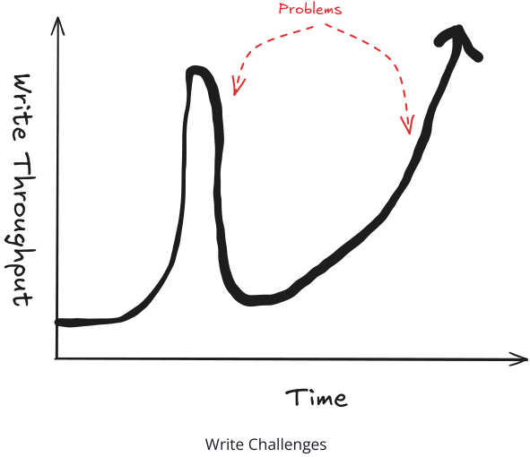
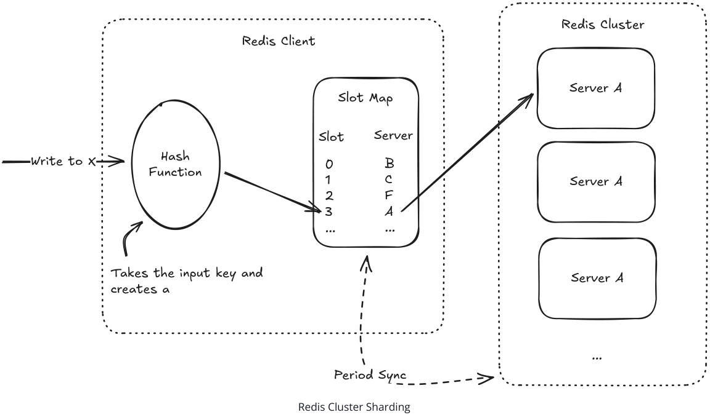
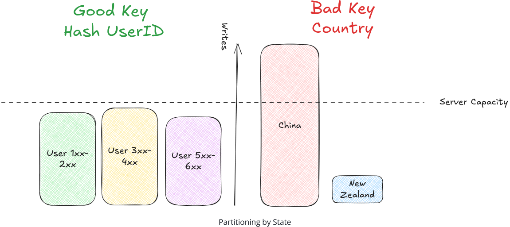
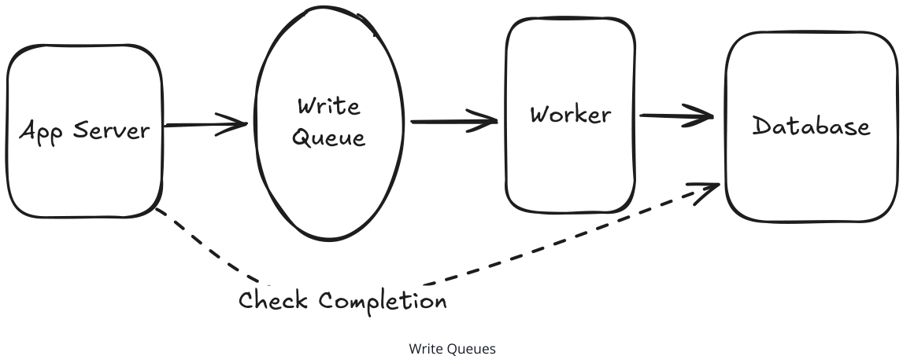
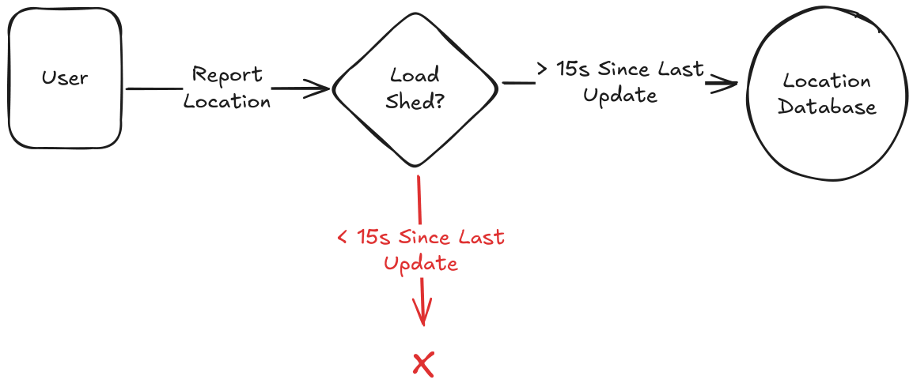
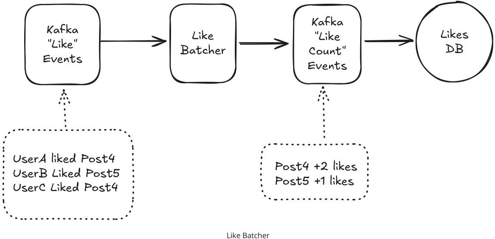
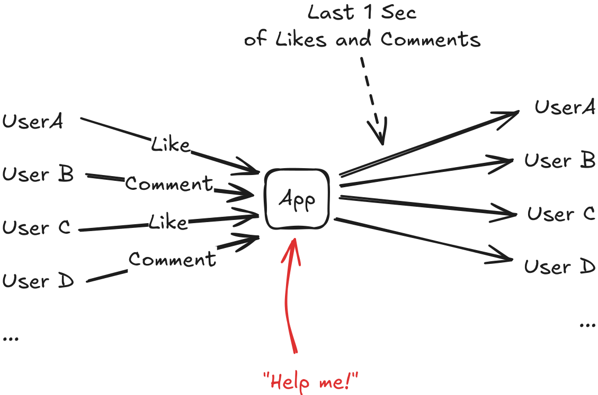
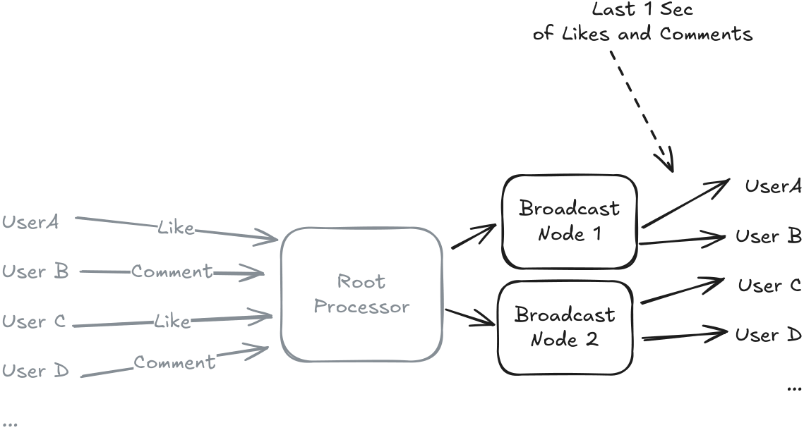
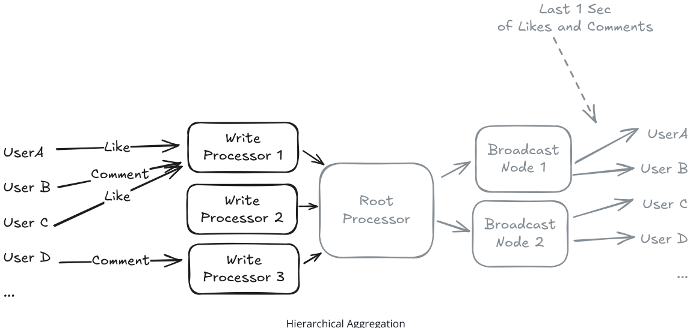
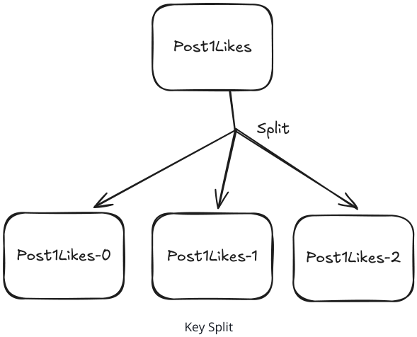

###### Patterns

# Scaling Writes

Learn about how to scale writes in your system design interview.

📈 Scaling Writes addresses the challenge of handling high-volume write operations when a single database or single server becomes the bottleneck. As your application grows from hundreds to millions of writes per second, individual components hit hard limits on disk I/O, CPU, and network bandwidth and interviewers love to probe these bottlenecks.

## The Challenge

Many system design problems start with modest scaling requirements before the interviewer throws down the gauntlet: "how does it scale?" While you might be familiar with tools to handle the read side of the equation (e.g. read replicas, caching, etc.) the write side is often a much bigger challenge.

Bursty, high-throughput writes with lots of contention can be a nightmare to build around and there are a bunch of different choices you can make to handle them or make them worse. Interviewers love to probe bottlenecks in your solution to see how you would react to the runaway success of their next product (whether that's realistic or not is a separate discussion!).


**Figure 1: The graph illustrates the fluctuation in write throughput over time, highlighting the challenges and potential problems that arise. The upward trend represents the increasing write throughput, while the downward curve indicates periods of contention and potential bottlenecks. The dashed circle emphasizes the critical points where system performance may degrade, requiring careful scaling strategies to maintain efficiency.**

In this pattern we're going to walk through the various scenarios and challenges you should expect to see in a system design interview, and talk about the strategies you can use to scale your system.


**Figure 2: The image depicts a stylized icon of a computer monitor with a graph inside, symbolizing the analysis and visualization of data trends. The graph within the monitor represents the scaling challenges and performance metrics associated with handling high-throughput writes in a system design context. The icon effectively communicates the focus on system performance and data analysis in the context of system design interviews.**

###### Problem Breakdowns with Scaling Writes Pattern

| YouTube Top K   | Strava              |
|-----------------|---------------------|
| Rate Limiter    | Ad Click Aggregator |
| FB Post Search  | Metrics Monitoring  |

## The Solution

Write scaling isn't (only) about throwing more hardware at the problem, there's a bunch of architectural choices we can make which improve the system's ability to scale. A combination of four strategies will allow you to scale writes beyond what a single, unoptimized database or server can handle:

1. Vertical Scaling and Database Choices
2. Sharding and Partitioning
3. Handling Bursts with Queues and Load Shedding
4. Batching and Hierarchical Aggregation

Let's first talk about how we can scale while staying safely in a single-server, single-database architecture before we start to throw more hardware at the problem!

### Vertical Scaling and Write Optimization

The first step in handling write challenges is to make sure we've exhausted the hardware at our disposal. We want to show our interviewer that we've done our due diligence and we're not prematurely adding complexity when hardware or local software tweaks will do it.

##### Vertical Scaling

We'll start with the hardware, or "vertical scaling". Writes are bottlenecked by disk I/O, CPU, or network bandwidth. We should confirm we're hitting those walls before we proceed. Often this means we need to do some brief back-of-the-envelope math to see both (a) what our write throughput actually is, and (b) whether that fits within our hardware capabilities. Many candidates are used to thinking about instances with 4-8 cores and a single, spinning-platted hard disk. But in many cases cloud providers and data center operators offer substantially more powerful hardware we can use before we need to re-architect our application. There's a good chance hardware can go further than you think! Systems with 200 CPU cores and 10gigabit network interfaces are not uncommon. It's worth brushing up on some Numbers to Know to make sure you're not missing out on a lot of potential.

You can make the case (and most interviewers will expect or appreciate it) that some of your challenge is solved with modern hardware. We most often see this from staff+ candidates who are intuitively familiar with the edges of the performance curves.

However, many interviewers have an assessment built out non-vertical scaling and they frequently will move the goalposts until you're forced to contend with scale in other ways. So make the case, but try not to get into a back-and-forth if the interviewer is not receptive.

##### Database Choices

The next thing we might do is to consider whether our underlying data stores are optimized for the writes we're doing. Most applications include a mix of reads and writes. We need to take both types of access into consideration as we make a decision about a data store, but oftentimes write-heavy systems can be optimized by stripping away at some of the features that are only used for reads.

A great example of this is using a write-heavy database like Cassandra . Cassandra achieves superior write throughput through its append-only commit log architecture. Instead of updating data in place (which requires expensive disk seeks), Cassandra writes everything sequentially to disk. This lets it handle 10,000+ writes per second on modest hardware, compared to maybe 1,000 writes per second for a traditional relational database doing the same work.

But here's the trade-off: Cassandra's read performance isn't great. Reading data often requires checking multiple files and merging results, which can be slower than a well-indexed relational database. So you're trading read performance for write performance, which is exactly what you want in a write-heavy system.

Write vs. Read Tension: This is a classic example of the fundamental tension in scaling writes. Optimizing for write performance often degrades read performance, and vice versa. You need to identify which is your bottleneck -writes or reads -and optimize accordingly. Different parts of your system may require different approaches.

Other databases make similar trade-offs in different ways:

- Time-series databases like InfluxDB or TimescaleDB are built for high-volume sequential writes with timestamps (they also have built-in delta encodings to make better use of the storage)
- Log-structured databases like LevelDB append new data rather than updating in place
- Column stores like ClickHouse can batch writes efficiently for analytics workloads

Choosing the right database is a big topic, but the key insight is that IF (a big if!) the write volume you're hitting is significant enough to architect your system around, you can make targeted choices that dramatically improve performance.

Beyond this, there are other things we can do to optimize any database for writes:

- Disable expensive features like foreign key constraints, complex triggers, or full-text search indexing during high-write periods
- Tune write-ahead logging -databases like PostgreSQL can batch multiple transactions before flushing to disk
- Reduce index overhead -fewer indexes mean faster writes, though you'll pay for it on reads

The key insight is that most general-purpose databases are designed to handle mixed workloads reasonably well, but they're not optimized for the extremes. When you know your system is writeheavy, you can make targeted choices that dramatically improve performance.

In interviews, mentioning specific database choices shows you understand the trade-offs. Don't just say "use a faster database" -explain why Cassandra's append-only writes are faster than MySQL's B-tree updates, or why you might choose a time-series database for metrics collection.

### Sharding and Partitioning

Ok, so we've exhausted our options with the existing hardware and need to go horizontal. What's next?

Well if one server can handle 1,000 writes/second, then 10 servers should (big should!) handle 10,000 writes/second. In the ideal state, we can distribute write volume across multiple servers so each one handles a manageable portion and win some free scalability.

We typically will call these extra servers "shards", and the many shards may actually exist as part of a logical database -we'll think of it like one. The fact that we require multiple servers is (mostly) hidden from the application.

##### Horizontal Sharding

A great, simple example of sharding is what Redis Cluster does. Each entry in Redis is stored with a single string key . These keys are hashed using a simple CRC function to determine a "slot number". These slot numbers are then assigned to the different nodes in the cluster.

Clients query the Redis Cluster to keep track of servers in the cluster and the slot numbers they are responsible for. When a client wants to write a value, it hashes the key to determine the slot number, looks up the server responsible for that slot, and sends the write request to that server.


**Figure 3: This diagram illustrates the process of Redis Cluster sharding. It shows how a Redis client uses a hash function to determine a slot number for a given key. The slot number is then mapped to a server within the Redis Cluster. The diagram highlights the interaction between the Redis client, the slot map, and the Redis Cluster, demonstrating how data is distributed across multiple servers. The periodic synchronization (Period Sync) ensures that the slot map is updated across all servers, maintaining consistency in the cluster.**

By doing so, we've spread our data across all of the servers in the cluster. Another approach is to use a consistent hashing scheme to determine which server to write to.

#### Selecting a Good Partitioning Key

In practice, interviewers are expecting you to say " sharding " but they want to know how that's going to work. The most important detail you'll want to share is how to select a partitioning key . If you've chosen a good key (say, hashing the userID), all of your data will be spread evenly across the cluster, so that we've solved the problem and realized our hypothetical gain of 10x by multiplying the number of servers by 10.

Many interviewers will accept that, if you have a good partitioning key, there's a straightforward way for clients to find the right server to access with that data. But it's not uncommon for interviewers to probe here for details on how that actually happens. Familiarizing yourself with consistent hashing, virtual nodes, and slot assignment schemes is a good way to ensure you're not caught off guard.

But what if we select a bad key? Let's pretend if, instead of hashing the userID we decided to use the user's country as the key. We might end up with a lot of writes going to highly populated China, and very few writes going to sparse New Zealand. This means the New Zealand shard will be underutilized and the China shard will be overloaded.


**Figure 4: This diagram illustrates the difference between using a good partitioning key (hashing the UserID) and a bad key (using the user's country). On the left, the UserID hashing results in an even distribution of writes across three shards, each representing a range of user IDs. On the right, using the country as the key leads to an uneven distribution, with a large number of writes concentrated in the China shard and very few in the New Zealand shard. This highlights the importance of selecting a partitioning key that minimizes variance in the number of writes per shard.**

The principle here is that we want to select a key that minimizes variance in the number of writes per shard or, in the visual above, flat is good . Frequently we can do that by taking a hash of a primary identifier (like userId, or postId). There should be a small number of candidate identifiers that stick out to you to choose from.

Keep in mind that we need to also consider how the data might be read. If you spread all of your writes across shards, but each request needs to collect data from every single shard, you'll have a lot of overhead as each reader needs to make lossy network calls to all the shards of the cluster!

For your data which gets the most reads and writes (sometimes called the "fastest" data), you should expect to have a discussion with your interviewer about how the data is physically arranged. You'll want to choose a scheme that spreads reads and writes as evenly as possible across your data while also grouping commonly accessed data together. Ask yourself "how many shards does this request need to hit?" and "how often does this request happen?" Those questions will help you decide whether you've created a bottleneck.

##### Vertical Partitioning

While horizontal sharding splits rows, vertical partitioning splits columns. You separate different types of data that have different access patterns and scaling requirements. Instead of cramming everything into one massive table, you break it apart based on how the data is actually used.

Think of a social media post. In a monolithic approach, you might have a single table or database with all of the data about a post:

```
TABLE posts ( id BIGINT PRIMARY KEY, user_id BIGINT, content TEXT, media_urls TEXT[], created_at TIMESTAMP, like_count INTEGER, comment_count INTEGER, share_count INTEGER, view_count INTEGER, last_updated TIMESTAMP );
```

This table gets hammered from all directions. Users write content, the system updates engagement metrics constantly, and analytics queries scan through massive amounts of data. Each operation interferes with the others.

With vertical partitioning, you split this into specialized tables:

```
-- Core post content (write-once, read-many)
TABLE post_content ( post_id BIGINT PRIMARY KEY, user_id BIGINT, content TEXT, media_urls TEXT[], created_at TIMESTAMP );
-- Engagement metrics (high-frequency writes)
TABLE post_metrics ( post_id BIGINT PRIMARY KEY, like_count INTEGER DEFAULT 0, comment_count INTEGER DEFAULT 0, share_count INTEGER DEFAULT 0, view_count INTEGER DEFAULT 0, last_updated TIMESTAMP );
-- Analytics data (append-only, time-series)
TABLE post_analytics ( post_id BIGINT, event_type VARCHAR(50), timestamp TIMESTAMP, user_id BIGINT, metadata JSONB );
```

Once we've logically separated our data, we can also move each table to a different database instance which can handle the unique workloads. Each of these databases can be optimized for its specific access pattern:

- For Post content we'll use traditional B-tree indexes and is optimized for read performance
- For Post metrics we might use in-memory storage or specialized counters for high-frequency updates
- For Post analytics we can use time-series optimized storage or database with column-oriented compression

The data modelling challenge is as much about how you logically think about your data as it is about the technical details of where it physically lives in your design!

### Handling Bursts with Queues and Load Shedding

While partitioning and sharding will get you 80% of the way to scale, they often stumble in production. Real-world write traffic isn't steady, and while scale often does smooth (Amazon's ordering volume is surprisingly stable), some bursts are common. Interviewers love to drill in on things like "what happens on black friday, when order volume 4x's" or "during new years, we triple the number of drivers on the road".

If we need to be able to 4x our write volume at peak, we can only be using 25% of our overall capacity during sleepier times. Most systems just aren't scaled this way! A lot of candidates think the solution here is "autoscaling", and autoscaling can be a great tool, but it's not panacea. Scaling up and down takes time, and worse with database systems it frequently means downtime or reduced throughput while the scaling is happening. That's exactly the opposite of what we generally want when our business is on fire.

This means we either need to (a) buffer the writes so we can process them as quickly as we can without failure, or (b) get rid of writes in a way that is acceptable to the business. Let's talk about both.

##### Write Queues For Burst Handling

The first idea that comes to mind for most candidates is to add a queue to the system, using something like Kafka or SQS. This decouples write acceptance from write processing, allowing the system to handle the writes as quickly as possible.


**Figure 5: This diagram illustrates the flow of data in a system where an app server sends write requests to a write queue. The queue then routes these requests to a worker, which processes them and writes the data to a database. Additionally, there is a feedback loop labeled 'Check Completion' that allows the app server to verify the successful completion of write operations in the queue.**

Because queues are inherently async, it means the app server only knows that the write was recorded in the queue, not that it was successfully written to our database. In most cases, this means that clients will often need a way to call back to check the write was eventually made to the database. No problem, for some cases! This approach provides a few benefits, but the most important is burst absorption : the queue acts as a buffer, smoothing out traffic spikes. Your database processes writes at a steady rate while the queue handles bursts. But queues are only a temporary solution, if the app server continues to write to the queue faster than records can be written to the database, we get unbounded growth of our queue. Writes take longer and longer to be processed. And while we might be able to scale our database to handle the increased load (and backlog we've accumulated into the queue), oftentimes this actually makes the problem worse as our users grow increasingly restless.

Queues are a powerful tool but candidates frequently fail to consider situations where they mask an underlying problem. Use queues when you expect to have bursts that are short-lived, not to patch a database that can't handle the steady-state load.

It's important to understand at the requirements stage what tolerance we have for delayed writes or inconsistent reads. In many cases, systems can tolerate a bit of delay, especially for rare cases where traffic is highest. If this is the case, using a queue may be a good way to go! But be careful of introducing a queue which disturbs key functional or non-functional requirements.

##### Load Shedding Strategies

Another option for handling bursts may seem like a cop-out, but it's actually a powerful tool. When your system is overwhelmed, you need to decide which writes to accept and which to reject. This is called load shedding, and it's better than letting everything fail. Load shedding tries to make a determination of which writes are going to be most important to the business and which are not. If we can drop the less important writes, we can keep the system running and the more important writes will still be processed. Consider problems like Strava or Uber where users are reporting their locations at regular intervals. If we have an excess number of users, adding a queue to the system sets us up for a blown out queue. But if we take a step back we can realize that users are going to keep calling back every few seconds to send us their location. If we drop one write, we should expect another write to be sent in a few seconds that will be fresher than the one we dropped!


**Figure 6: This flowchart illustrates the process of load shedding for location updates. It shows how a user reports their location, which is then evaluated to determine if it should be stored in the location database. If the time since the last update is greater than 15 seconds, the update is accepted; otherwise, it is rejected. This mechanism helps manage system load by prioritizing updates that are more than 15 seconds apart.**

A simple solution here is to simply drop the least useful writes during times of system overload. For Uber these might be location updates that are within seconds of a previous update. For an analytics system, we might drop impressions for a while to ensure we can process the more important clicks.

Depending on the system, putting some release valves in place shows we can keep a bad situation (too much load) from turning into a disaster (system failure), even if it means a suboptimal experience for some users.

### Batching and Hierarchical Aggregation

While previous solutions accept that the existing writes are given, frequently we can change the structure of the writes to make them easier to process. Individual write operations have overhead like network round trips, transaction setup, index updates. Additionally, most databases process batches more efficiently than individual writes. When our database becomes the bottleneck, we can look upstream to see how we can make the incoming data easier to process.

##### Batching

One example of this is batching writes together. Instead of processing writes one by one, you batch multiple writes together to amortize this overhead. This can be done at the application layer, as an in-between process, or even at the database layer.

#### Application Layer

At the application layer, our clients can simply batch up writes together before we send them to the database. This works especially well when the application itself isn't the source of truth for the data.

For example, if we have a service reading from a Kafka topic, performing some processing, and then writing to the database, we can batch up the writes together before we send them to the database. If the application crashes, we'll have to re-read the Kafka topic to recover but we haven't lost data.

If the application is the source of truth for the data, we need to be able to handle the potential for data loss. The worst case would be that users send requests which are confirmed and placed in a batch only to have the service crash before the writes are sent to the database to be committed. Not all applications can handle this!

#### Intermediate Processing

Another option is to have an intermediate process which batches up writes before they are sent to the database. Consider a system which accepts a "Like" event and tries to keep track of the count of likes for the post.


**Figure 7: This diagram illustrates the flow of a system designed to batch and process 'Like' events. It shows how Kafka 'Like' events are received and processed by the 'Like Batcher', which aggregates these events into 'Like Count' events. These aggregated events are then sent to a 'Likes DB' for storage. The diagram also includes examples of user interactions and the resulting changes in like counts for specific posts, demonstrating the batching process in action.**

Our Like Batcher can read a number of these events, tabulate the changes to the count of likes for each post, and then forward on those changes to the database. If a post receives 100 likes in a single window (say 1 minute), we reduce the number of writes from 100 to 1!

Staff-level candidates should expect to get into the weeds of batching efficacy. If the majority of posts are getting 1 like an hour, a batch frequency of 1 minute provides 0 benefit to the system! We need to ensure the batching itself is actually helpful.

#### Database Layer

The last layer for us to consider is the database layer. Most database systems have configurable options for how often writes are flushed to disk, the bottleneck for most systems.

As an example, Redis' default configuration is to flush writes to disk every 100ms. This means that if we have 1000 writes in a single batch, we'll only write to disk 100ms after the last write.

While there is some elegance to doing this at the database layer, it's definitely the "big hammer" solution to the problem and should be reserved for extreme cases.

##### Hierarchical Aggregation

This last strategy applies in some of the most extreme cases. For high-volume data like and stream processing, you often don't need to store individual events and instead need aggregated views. The important insight is that these views can be built up incrementally. Hierarchical aggregation processes data in stages, reducing volume at each step.

analytics Let's talk about a concrete example. In live video streams, viewers are often able to both comment and like comments on the stream. Whenever a viewer performs either of these events, all other users need to be notified of it. This creates an ugly situation if there are millions of viewers, millions of users are writing, and all of the writes need to be to sent to all of their peers!


**Figure 8: This diagram illustrates the Fan-In, Fan-Out problem in live video streams where multiple users simultaneously perform actions like liking and commenting. The 'App' in the center represents the application receiving these events from all users. The arrows show the flow of these events to the application, which then needs to broadcast these updates to all users, leading to a high volume of writes and potential performance issues. The red arrow labeled 'Help me!' humorously highlights the challenge of managing such a high volume of data.**

But wait, we can simplify this a bit. All of our viewers are looking for the same, eventually consistent view: they want to see all the latest comments and the counts associated with them. We'll assign the users to broadcast nodes using a consistent hashing scheme. Instead of writing independently to each of them, we can write out to broadcast nodes which can forward updates to their respective viewers.


**Figure 9: This diagram illustrates the hierarchical aggregation process in managing live video streams, where user interactions (likes and comments) are first aggregated by broadcast nodes and then forwarded to the root processor. This method reduces the number of writes required by the system, making it more scalable for high-volume data processing.**

Now instead of writing to N viewers, we only have to write to M broadcast nodes. Great! But we still have one more problem, our root processor is receiving the incoming events from all the viewers. Fortunately, we can handle this in much the same way:


**Figure 10: This diagram illustrates the hierarchical aggregation process in managing live video streams with real-time interactions. It shows how user events (likes and comments) are processed by write processors, which then aggregate and forward updates to a root processor. The root processor consolidates these updates and broadcasts them to broadcast nodes, which in turn distribute the information to the respective viewers. This method reduces the number of writes required by the system, making it more scalable for high-volume data like live video streams.**

The write processor we call out to can be chosen based on the ID of the comment (or, for likes, the comment ID it is liking). The write processors can then aggregate the likes on the comments they own, over a window, and forward a batch of updates to the root processor, who only needs to merge them.

By aggregating the data with the write processors and dis-aggregating it with the broadcast nodes, we've substantially reduced the number of writes that any one system needs to handle at the cost of some latency introduced by adding steps. And that's the heart of hierarchical aggregation!

## When to Use in Interviews

Write scaling patterns show up in many high-scale system design interview. You won't want to wait for the interviewer to ask about it, instead proactively identify bottlenecks, validate them, and propose solutions as deep dives.

An example of a strong candidate's response:

- "With millions of users posting content, we'll quickly hit write bottlenecks. Let me see what kind of write throughput we're dealing with ...Ok this is significant! I'll come back to that in my deep dives."
- "For the posting writes, I think it's sensible for us to partition our database by user ID. This will spread the load evenly across our shards. We'll still need to handle situations where a single user is posting a lot of content, but we can handle that with a queue and rate limits."

### Common Interview Scenarios

Instagram/Social Media -Perfect for demonstrating sharding by user ID for posts, vertical partitioning for different data types (user profiles, posts, analytics), and hierarchical storage for older posts. News Feeds -News feeds require careful tuning between write volume for celebrity posts which need to be written to millions of followers and read volume when those millions of use come to consume their feed. Search Applications -Search applications are often write-heavy with substantial preprocessing required in order to make the search results quick to retrieve. Partitioning and batching are key to making this work. Live Comments -Live comments are a great example of a system which can benefit from hierarchical aggregation to avoid an intractable all-to-all problem where millions of viewers need a shared view of the activities of millions of their peers.

### When NOT to Use in Interviews

Be careful of employing write scaling strategies when no scaling is necessary! If you see something that looks like it might be a bottleneck, that's a good time to use some quick back-of-the-envelope math to see if it's worth the effort. Each of these strategies comes with tradeoffs. Queues mean eventual consistency and delay, partitioning means the read path may be compromised, batching adds latency and moving pieces. Show your interviewer that you're cognizant of these tradeoffs before making a proposal. The worst case is creating a problem where one doesn't exist!

## Common Deep Dives

Interviewers love to test your understanding of write scaling edge cases and operational challenges. Here are some of the most common follow-up questions:

### "How do you handle resharding when you need to add more shards?"

This is the classic operational challenge with sharding. You started with 8 shards, but now you need 16. How do you migrate data without downtime?

The naive approach is to take the system offline, rehash all data, and move it to new shards. But this creates hours of downtime for large datasets. Production systems use gradual migration which targets writes to both locations (e.g. the shard we're migrating from and the shard we're migrating to). This allows us to migrate data gradually while maintaining availability.

The dual-write phase ensures no data is lost during migration. You write to both old and new shards, but read with preference for the new shard. This allows you to migrate data gradually while maintaining availability.

### "What happens when you have a hot key that's too popular for even a single shard?"

We talked earlier about how we need to spread load evenly across our shards. Sometimes, in spite of even the best choices around keys, a shard can still have a disproportionate traffic pointed at it. Consider a viral tweet that receives 100,000 likes per second. Even though we've spread out our tweets evenly across our shards, this tweet may still cause us problems! Even dedicating an entire shard to this single tweet isn't enough. We have two major options for handling this:

##### Split All Keys

The first option is to split all keys a fixed k number of times. This is a pretty big hammer, but it's the simplest solution. Instead of having each tweet's likes be stored on a single shard, we can instead store them across multiple shards. For the post1Likes key, we can have post1Likes-0 , post1Likes-1 , post1Likes-2 , all the way through to post1Likes-k-1 . This means that each shard will only have a subset of the data for a given post, but the write volume for a given shard for a given post is reduced by k times.


**Figure 11: This diagram illustrates the process of splitting a key, such as 'Post1Likes', into multiple sub-keys ('Post1Likes-0', 'Post1Likes-1', 'Post1Likes-2') to distribute the load across different shards. The 'Split' label at the center indicates the point where the key is divided, ensuring that each sub-key is stored on a separate shard. This setup is designed to reduce the write volume for a given shard, thereby improving the efficiency of data storage and retrieval.**

###### This has some big downsides:

- By doing so we're both increasing the size of our overall dataset by k times.
- We've also multiplied the read volume by k . In order to get the number of likes for a given post, we need to reach postId-0 , postId-1 , postId-2 , all the way through to postId-k-1 .

But if a small k brings our workload comfortably back into line with our database's write capacity, we've solved our problem!

##### Split Hot Keys Dynamically

Another solution is breaking the hot key into multiple sub-keys dynamically based on whether the key is hot or not. For the viral tweet example, you might split the like count across 100 sub-keys, each handling 1,000 likes per second. When reading, you aggregate the counts from all sub-keys. Both of these approaches work for metrics that can be aggregated (likes, views, counts, balances) but don't work for data that must remain atomic (user profiles). Fortunately, the latter category is rarely under the same type of write pressure as the former. Importantly, both readers and writers need to be able to agree on which keys are hot for this to work. If writers are spreading writes across multiple sub-keys, but readers aren't reading from all sub-keys, we have a problem! We have two main solutions here:

1. We can have the readers always check all the sub-keys. This means the same read amplification as the key split approach, but it's simple to implement and easy to understand. When a writer detects a key may be hot (they can keep local statistics), they can conditionally write to the sub-keys for that key.
2. Another, more burdensome approach is to have the writers announce the split to the readers. All readers would need to receive this announcement before the split is executed. This is more complex to implement and understand, but it's more efficient and keeps readers from reading splits that don't exist.

Most production systems use the first approach because it's simpler and the overhead of checking for sub-keys is minimal compared to the performance gain from handling hot keys properly. Avoid overengineering your solution in the interview!

## Conclusion

Write scaling comes down to four fundamental strategies that work together: vertical scaling and database choices , sharding and partitioning , queues and load shedding , and batching and multi-step reducers . The most successful interviews don't overcomplicate these concepts, they look for places where they are required and apply them strategically.

An easy mistake to make is to employ write scaling strategies when no scaling is necessary! If you see something that looks like it might be a bottleneck, that's a good time to use some quick back-of-the-envelope math to see if it's worth the effort.

Sharding and partitioning is a great place to start when you're trying to scale your system. It's a simple strategy that can give you a lot of bang for your buck, and most interviews are going to be expecting it.

If you're dealing with high volume analytics or numeric data, batching and hierarchical aggregation can give you immediate 5-10x improvements.

Finally, queues and load shedding are great tools when requirements allow for async processing or even dropping requests. Keep them in mind as you're navigating requirements to see if they're a good fit.

The key insight is that write scaling is about reducing throughput per component . Whether you're spreading 10,000 writes across 10 shards, smoothing bursts through queues, or batching them into 100 bulk operations, you're applying the same principle: make each individual component handle manageable load.