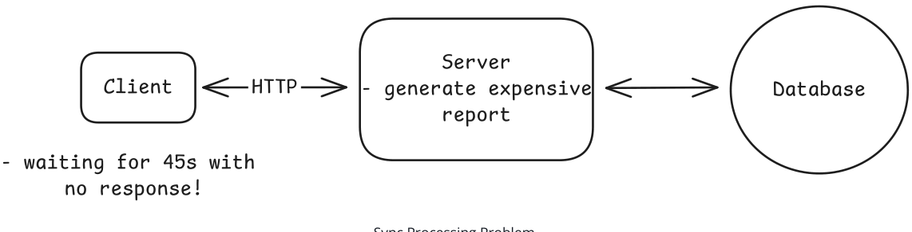
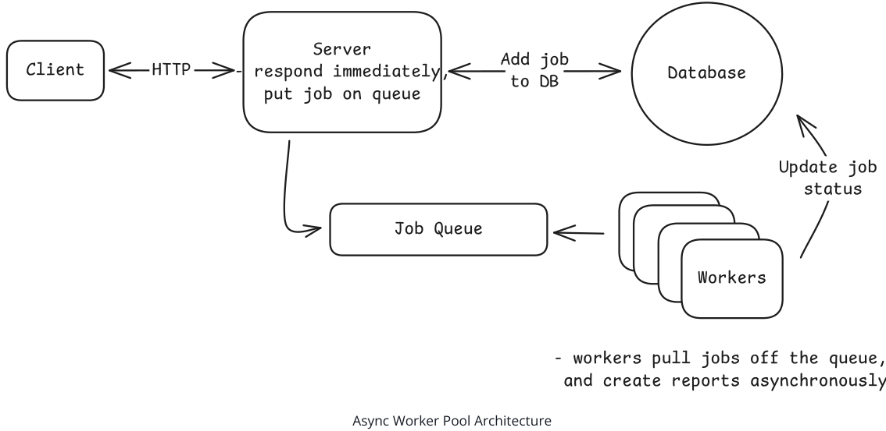
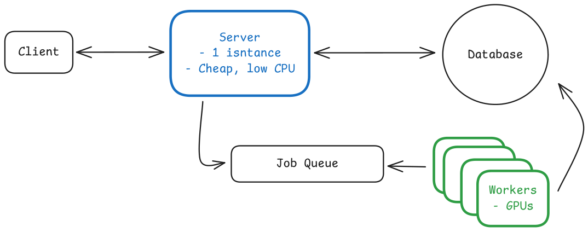
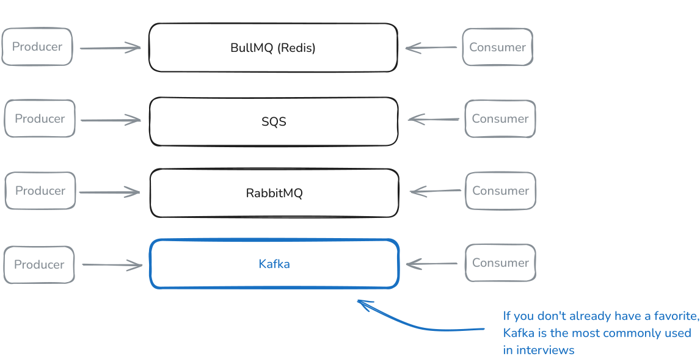
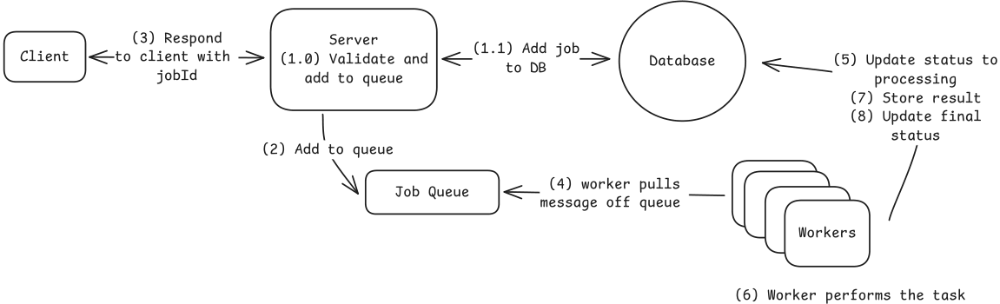
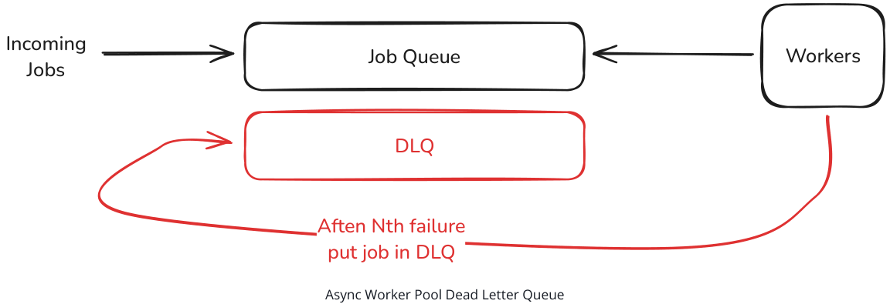
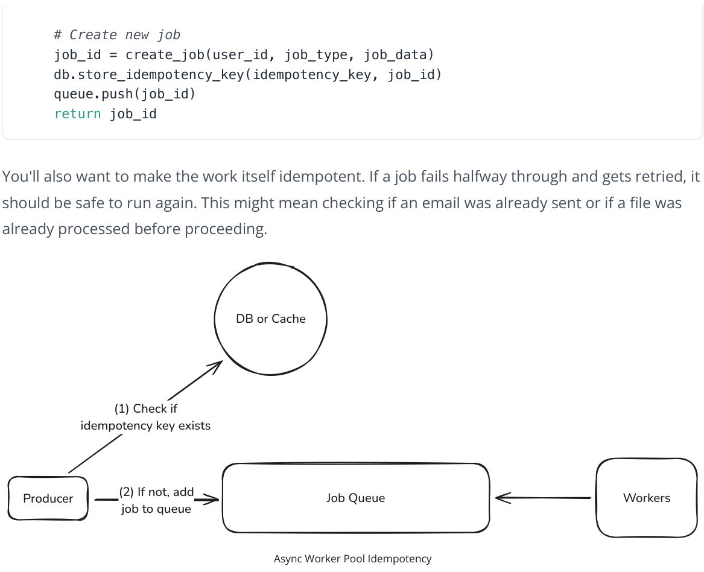
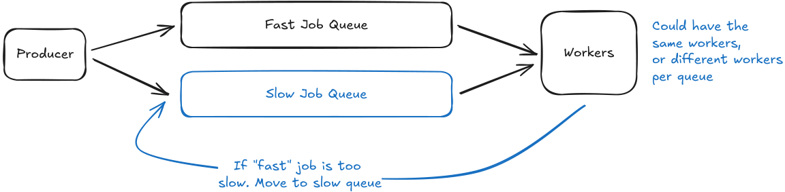

# Managing Long Running Tasks

Learn about the long running tasks pattern and how to use it in your system design Managing Long Running Tasks Published Jun 25, 2025 🏃 The Managing Long-Running Tasks pattern splits API requests into two phases: immediate acknowledgment and background processing. When users submit heavy tasks (like video encoding), the web server instantly validates the request, pushes a job to a queue (Redis/RabbitMQ), and returns a job ID, all within milliseconds. Meanwhile, separate worker processes continuously poll the queue, grab pending jobs, execute the actual time-consuming work, and update the job status in a database.

## The Problem

Let's start with a problem. Imagine you run a simple website where users can view their profile. When a user loads their profile page, your server makes a quick database query to fetch their data. The whole process -querying the database, formatting the response, sending it back -takes less than 100 milliseconds. The user clicks and almost instantly sees their information. Life is good.

Now imagine that instead of just fetching data, we need to generate a PDF report of the user's annual activity. This involves querying multiple tables, aggregating data across millions of rows, rendering charts, and producing a formatted document. The whole process takes at least 45 seconds.

###### Synchronous processing of expensive tasks = BAD


**Figure 1: This diagram illustrates the issue of synchronous processing where a client's browser waits for 45 seconds for a server to generate an expensive report. The server's task is depicted as accessing the database, which is a critical step in the process. The client's frustration is highlighted by the text 'waiting for 45s with no response!', emphasizing the poor user experience and the potential for user abandonment.**

Sync Processing Problem With synchronous processing, the user's browser sits waiting for 45 seconds. Most web servers and load balancers enforce timeout limits around 30-60 seconds, so the request might not even complete. Even if it does, the user experience is poor. They're staring at a loading indicator with no feedback about progress. The PDF report isn't unique. Video uploads, for example, require transcoding that takes several minutes. Profile photo uploads need resizing, cropping, and generating multiple thumbnail sizes. Bulk operations like sending newsletters to thousands of users or importing large CSV files take even longer. Each of these operations far exceeds what users will reasonably wait for. Even if you could scale infinitely, synchronous processing provides terrible user feedback. The user clicks "Generate Report" and then... nothing. Is it working? Did it fail? Should they refresh? After 30 seconds of waiting, many users assume something broke and try again, creating duplicate work that makes the problem worse. Alright, so synchronous processing clearly has its limits when operations take more than a few seconds. What's the alternative?

#### Problem Breakdowns with Managing Long Running Tasks Pattern

Instagram LeetCode ChatGPT

## The Solution

Instead of making the user wait while we generate their PDF, we split the operation into two parts. When they click "Generate Report", we immediately store their request in a queue and return a response: "We're generating your report. We'll notify you when it's ready." This takes milliseconds, not minutes. The web server's job is now super simple. It just validates the request, adds it to a queue, and returns a job ID. The actual PDF generation happens somewhere else entirely.


**Figure 2: This diagram illustrates the Async Worker Pool Architecture, where a client sends an HTTP request to a server, which immediately responds and adds the job to a database. The job is then placed in a job queue, from which workers pull tasks and process them asynchronously. The workers update the job status in the database as they complete their tasks. This architecture decouples request acceptance from request processing, allowing the server to handle multiple requests quickly while the workers handle the actual processing in the background.**

web server fleet. Each component scales based on its specific needs.


**Figure 3: This diagram illustrates the architecture of an asynchronous worker pool system. It shows a client sending a request to a lightweight server, which stores the request in a job queue. The server then returns a job ID to the client. Workers, equipped with GPUs, pull jobs from the queue and process them. The database is also connected to the queue, indicating that it might be used for storing job statuses or other related data. The diagram highlights the separation of concerns between the client-server interaction, the job queue, and the worker pool, emphasizing the efficiency and scalability of this pattern.**

The user experience improves dramatically too. Instead of staring at a frozen browser, users get immediate confirmation that their request was received. They can check back later to see their position in the queue or processing progress. When the job completes, you notify them via email, push notification, or WebSocket update . They're free to navigate away, close their laptop, and come back when the work is actually done. This pattern applies broadly to any operation that takes more than a few seconds. Image processing, video transcoding, bulk data imports, third-party API calls with strict rate limits, report generation, email campaigns -they can all benefit from async processing. The specific queue technology and worker implementation might vary, but the core pattern remains the same. Accept quickly, process asynchronously, notify when complete.

## Trade-offs

Managing long-running tasks isn't magic. This approach solves some problems but creates others. Here's what you're getting into:

### What you gain

- Fast user response times -API calls return in milliseconds instead of timing out after 30 seconds. Users get immediate acknowledgment that their request was received.
- Independent scaling -Web servers and workers scale separately. Add more workers during peak processing times without paying for idle web servers.
- Fault isolation -A worker crash processing one video doesn't bring down your entire API. Failed jobs can be retried without affecting user-facing services.
- Better resource utilization -CPU-intensive workers run on compute-optimized instances. Memory-heavy tasks get high-memory machines. Web servers use cheap, general-purpose instances.

### What you lose

- System complexity -You now have queues, workers, and job status tracking to manage. More moving parts means more things that can break.
- Eventual consistency -The work isn't done when the API returns. Users might see stale data until background processing completes.
- Job status tracking -You need infrastructure to store job states, handle retries, and expose status endpoints. This adds database load and API complexity.
- Monitoring overhead -Queue depth, worker health, job failure rates, processing latency -you're monitoring a distributed system instead of simple request/response cycles.

Plus async patterns create new failure modes. What happens when the queue fills up? How do you handle poison messages that crash workers repeatedly? When do you give up retrying a failed job? These problems aren't impossible to solve, but they need planning that synchronous systems don't.

## How to Implement

At its core, two technologies are required to pull this off:

1. Message Queue : A message queue is a system that allows you to send and receive messages between different parts of your system. It's a way to decouple the sender and receiver of a message, allowing them to operate independently.
2. Pool of Workers : A pool of workers is a group of processes that are dedicated to processing messages from a queue. They are responsible for pulling messages from the queue, processing them, and updating the job status.

Let's break down each component and the common technology choices you'll discuss in interviews.

### Message Queue

The queue needs to be durable. If it crashes, you can't lose all pending jobs. It also needs to handle concurrent access from multiple workers without duplicating work. Here are the standard options: Redis with Bull/BullMQ is the go-to for many startups. Redis provides the storage, while Bull adds job queue semantics on top: automatic retries, delayed jobs, priority queues. It's simple to set up and "just works" for 90% of use cases. While Redis offers persistence options, it's still memory-first, so you can lose jobs in a hard crash. For true durability, you'd want SQS or RabbitMQ. AWS SQS removes the operational overhead entirely which is nice. Amazon manages the infrastructure, handles scaling, and guarantees message delivery. You pay per message, which is great at low volume but can get expensive at scale. The 1MB message size limit means you're typically still storing job data elsewhere and just passing IDs through the queue. RabbitMQ gives you more control with complex routing patterns, but requires self-hosting. It's battle-tested in enterprise environments and handles sophisticated workflows well. The operational burden is real though. You need to manage clusters, handle upgrades, and monitor disk usage. Kafka is the go-to, especially when your stack already uses event streaming. Its append-only log you replay messages, fan-out to multiple consumers, and keep data around for long retention lets windows-while still handling huge volumes with strict ordering guarantees (within a partition).

### Workers

Workers pull jobs from the queue and execute them. The key decision is how to run these workers:

"Normal" servers are the simplest approach. You run 10-20 worker processes on a few machines, each pulling jobs in a loop. This gives you full control over the environment and makes debugging straightforward since you can SSH into the box and inspect what's happening. Long-running jobs aren't a problem when you control the infrastructure. The downside is you're managing servers and paying for idle capacity during quiet periods.

```
# Simplified worker loop
while True: job = queue.pop()
# Blocks until job available
if job: process_job(job) mark_complete(job.id)
```

Serverless functions (Lambda, Cloud Functions) eliminate server management. Each job triggers a function execution that scales automatically. This works beautifully for spiky workloads where you might process 1,000 jobs one minute and zero the next. You only pay for actual execution time. But Top Message Queue options:


**Figure 4: This diagram compares different message queue systems (BullMQ, SQS, RabbitMQ, and Kafka) in terms of producer and consumer roles. Each system is represented by a central box with arrows indicating the flow of messages from producers to consumers. The highlighted Kafka box with a note suggests its popularity in interviews, indicating its significance in the context of the document.**

the constraints are meaningful here. You're limited to 15-60 minute executions (depending on provider), cold starts add latency, and local storage is minimal.

Container-based workers (on Kubernetes or ECS) offer a middle ground. You package workers as Docker containers and let the orchestrator handle scaling and deployment. This approach is more complex than plain servers but gives you more flexibility than serverless. You can still handle longrunning jobs while getting better resource utilization through automatic scaling.

### Putting It Together

Here is how everything works together:

1. Web server validates the request and creates a job record in your database with status "pending"
2. Web server pushes a message to the queue containing the job ID (not the full job data)
3. Web server returns the job ID to the client immediately
4. Worker pulls message from queue, fetches job details from database
5. Worker updates job status to "processing"
6. Worker performs the actual work
7. Worker stores results (in S3 for files, database for metadata, etc.)
8. Worker updates job status to "completed" or "failed"


**Figure 5: This diagram illustrates the flow of a job processing system where a client initiates a request, which is validated and added to a queue by a server. The queue manages the job flow, and workers pull tasks from the queue to perform the required operations. The system is designed to handle failures independently, ensuring that the database and workers can retry until the job is completed. The final status of the job is updated in the database, and the result is stored for future reference.**

Importantly, each component can fail independently and the system will still function. If the queue goes down, web servers still accept requests and jobs pile up in the database as "pending". When workers crash, jobs stay in the queue until new workers come online. If the database has issues, workers can retry until it recovers.

In interviews, don't overcomplicate this. Pick Kafka (or a queue you know well) for the queue unless there's a specific reason not to. Use regular server processes for workers unless the interviewer pushes for serverless. Focus on showing that you understand the separation of concerns rather than debating the merits of different queue technologies.

## When to Use in Interviews

Don't wait for the interviewer to ask about managing long-running tasks. The key is recognizing problems that scream for async processing and proactively suggesting it.

Here are some common signals to watch for that should trigger your thinking about managing longrunning tasks:

1. When they mention specific slow operations -The moment you hear "video transcoding", "image processing", "PDF generation", "sending bulk emails", or "data exports" that's your cue. These operations take seconds to minutes. Jump in immediately: "Video transcoding will take several minutes, so I'll return a job ID right away and process it asynchronously."
2. When the math doesn't work -If they say "we process 1 million images per day" and you know image processing takes 10 seconds, do the quick calculation out loud: "That's about 12 images per second, which means 120 seconds of processing time per second. We can't run that on our web servers -they'd be completely saturated with image processing and unable to serve user requests. I'll offload this to a dedicated pool of async workers so the web tier stays fast and the workers can scale independently on compute-optimized hardware."
3. When different operations need different hardware -If the problem involves both simple API requests and GPU-heavy work (like ML inference or video processing), that's a clear async signal. "We shouldn't run GPU workloads on the same servers handling login requests. I'll separate these with async workers on GPU instances."
4. When they ask about scale or failures -Questions like "what if a server crashes during processing?" or "how do you handle 10x traffic?" are perfect openings to introduce async workers. "With async workers, if one crashes mid-job, another worker picks it up from the queue. No user requests are lost."

The skill is being proactive. You should be the one pointing out that operations will take too long, not waiting for them to ask. This shows system design maturity, you're thinking about timeouts, resource utilization, and user experience before they even bring up these concerns.

### For Example

Let's look at how managing long-running tasks shows up in popular system design interview questions. For each of these, we have detailed breakdowns showing exactly how async workers fit into the broader system design: YouTube/Video Platforms -Video upload triggers multiple async jobs: transcoding to different resolutions (1080p, 720p, 480p), generating thumbnails, extracting closed captions, running content moderation. Each video might need hours of processing across multiple workers. Instagram/Photo Sharing -Photo uploads spawn async tasks for generating multiple sizes, applying filters, extracting metadata, running image recognition for tags, and checking content policy. The fan-out problem also uses async workers: when someone with millions of followers posts, workers propagate that post to follower feeds. Uber/Ridesharing -Ride matching runs asynchronously. The user sees "Finding drivers near you..." while workers evaluate driver availability, calculate optimal routes, and determine pricing. Driver location updates also process through async workers to update rider apps without overloading the main API. Stripe/Payment Processing -While basic card authorizations are synchronous, async workers handle fraud detection, 3D Secure verification, and webhook notifications. For payment methods with delayed confirmation (bank transfers, some regional methods), the API returns a pending status while workers process the actual settlement. Dropbox/File Sync -File uploads trigger async processing: virus scanning, indexing for search, generating previews, and syncing to other devices. Large files might take minutes to process, but the upload API returns immediately. Notice the pattern: any operation involving heavy computation, external API calls, or fan-out to multiple users benefits from async processing. If the interviewer mentions any of these scenarios, managing long-running tasks should be part of your solution.

## Common Deep Dives

As you already know, interviewers love to catch you off guard and need to dig. Here are the five common areas of exploration, along with how to handle each one. It may be that you bring these up proactively, or they may be asked of you.

### Handling Failures

Your interviewer might start with a basic question like "what happens if the worker crashes while working the job?" The answer is pretty simple if we've been following the pattern. The job will be retried by another worker. But how do we know the worker crashed? Typically, you'll have a heartbeat mechanism that periodically checks in with the queue to let it know that the worker is still alive. If the worker doesn't check in, the queue will assume it's dead and will retry the job. The interval of the heartbeat is a key design decision. If it's too long, crashes will mean the jobs are significantly delayed (the queue will optimistically assume the worker is still alive for much longer than it actually is). If it's too short, you'll be sending a lot of unnecessary messages to the queue or worse, you may mark jobs as failed when in fact they're still running (e.g. a garbage collection pause). Each queue system has a different way of handling this. For example, in SQS, you can set a visibility timeout. In RabbitMQ, you can set a heartbeat interval. In Kafka, you can set a session timeout. Choose the longest interval that is permissible by your users/clients in terms of extra delay. For most systems, 10-30 seconds is a good starting point.

### Handling Repeated Failures

The interviewer asks: "What happens if a job keeps failing? Maybe there's a bug in your code or bad input data that crashes the worker every time." Without handling, failed jobs get retried forever. Your workers waste cycles on doomed jobs while valid work backs up in the queue. Even worse, a poison message that crashes workers can take down your entire worker fleet as each one tries to process it and dies. The solution is a Dead Letter Queue (DLQ). After a job fails a certain number of times (typically 3-5), you move it to a separate queue instead of retrying again. This isolates problematic jobs while letting healthy work continue. Your DLQ becomes a collection of jobs that need human investigation. Maybe there's a bug to fix or data to clean up. Once fixed, you can move jobs back to the main queue for reprocessing. Most queue systems have built-in DLQ support. In SQS, you configure a redrive policy. In RabbitMQ, you set up a dead letter exchange. The key is monitoring your DLQ since a growing dead letter queue usually signals a bug in your system that needs immediate attention.


**Figure 6: This diagram illustrates the flow of jobs in an asynchronous worker pool system. Jobs enter the Job Queue, where they are processed by Workers. If a job fails a certain number of times (Nth failure), it is moved to the Dead Letter Queue (DLQ) instead of being retried. The DLQ serves as a collection of jobs that need human investigation, allowing the system to isolate problematic jobs and continue processing healthy work. This setup helps manage failed jobs and prevent them from overwhelming the system, ensuring that the worker fleet remains operational.**

### Preventing Duplicate Work

The interviewer continues: "A user gets impatient and clicks 'Generate Report' three times. Now you have three identical jobs in the queue. How do you prevent doing the same work multiple times?" Without deduplication, you waste resources processing identical jobs. Worse, you might send three emails to the same user or charge their credit card three times. Side effects compound when jobs aren't idempotent. The solution is idempotency keys. When accepting a job, require a unique identifier that represents the operation. For user-initiated actions, combine user ID + action + timestamp (likely rounded to the duration you want to prevent duplicate work on). For system-generated jobs, use deterministic IDs based on the input data. Before starting work, check if a job with this key already exists. If it does, return the existing job ID instead of creating a new one.

def submit_job(user_id, job_type, job_data, idempotency_key):

# Check if job already exists existing_job = db.get_job_by_key(idempotency_key)

if existing_job:

return existing_job.id


**Figure 7: This diagram illustrates the process of ensuring idempotency in asynchronous job queues. It shows a producer checking if an idempotency key exists in a database or cache (1). If the key does not exist, the job is added to the queue (2). This ensures that the same job is not processed multiple times, even if it is retried. The diagram highlights the interaction between the producer, the job queue, and the workers, emphasizing the role of idempotency keys in maintaining the integrity of the system.**

### Managing Queue Backpressure

Next question: "It's Black Friday and suddenly you're getting 10x more jobs than usual. Your workers can't keep up. The queue grows to millions of pending jobs. What do you do?" When workers can't process jobs fast enough, queues grow unbounded. Memory usage explodes. Job wait times stretch to hours. New jobs get rejected because the queue is full. Users get frustrated waiting for results that never come. The solution is called backpressure. It slows down job acceptance when workers are overwhelmed. You can set queue depth limits and reject new jobs when the queue is too deep and return a "system busy" response immediately rather than accepting work you can't handle. You should also autoscale workers based on queue depth. When the queue grows beyond a threshold, spin up more workers. When it shrinks, scale down. CloudWatch alarms + Auto Scaling groups make this straightforward on AWS. The key metric is queue depth, not CPU usage. By the time CPU is high, your queue is already backed up.

### Handling Mixed Workloads

The interviewer probes: "Some of your PDF reports take 5 seconds, but end-of-year reports take 5 hours. They're all in the same queue. What problems does this cause?" Long jobs block short ones. A user requesting a simple report waits hours behind someone's massive year-end export. Worker utilization becomes uneven as some workers process hundreds of quick jobs while others are stuck on single long jobs. Autoscaling becomes a huge pain when you can't predict how long jobs will take. The solution is to separate queues by job type or expected duration. Quick reports go to a "fast" queue with many workers. Complex reports go to a "slow" queue with fewer, beefier workers. This prevents head-of-line blocking and lets you tune each queue independently. Alternatively, you can break large jobs into smaller chunks that use the same queue infrastructure, like splitting news feed fanout into batches of followers.

| queues:        |           |
|----------------|-----------|
| fast:          |           |
| max_duration:  | 60s       |
| worker_count:  | 50        |
| instance_type: | t3.medium |
| slow:          |           |
| max_duration:  | 6h        |
| worker_count:  | 10        |
| instance_type: | c5.xlarge |

Route jobs to the appropriate queue when submitted. If you can't predict duration upfront, start jobs in the fast queue and move them to the slow queue if they exceed a time limit. This keeps your fast queue responsive while giving long jobs the resources they need.


**Figure 8: This diagram illustrates a system where jobs are categorized into 'Fast Job Queue' and 'Slow Job Queue' based on their expected duration. The 'Producer' submits jobs to these queues, which are then processed by 'Workers'. If a job in the 'Fast Job Queue' takes longer than expected, it is automatically moved to the 'Slow Job Queue' to ensure the fast queue remains responsive. This setup helps in managing worker utilization and queue performance efficiently.**

### Orchestrating Job Dependencies

Finally: "What if generating a report requires three steps: fetch data, generate PDF, then email it. How do you handle jobs that depend on other jobs?"

Without proper orchestration, you end up with spaghetti code. Workers complete step 1 then directly queue step 2, making the flow hard to understand and modify. Error handling becomes a nightmare -if step 2 fails, should you retry just that step or start over? Monitoring which step failed and why requires digging through logs.

For simple chains, have each worker queue the next job before marking itself complete. Include the full context in each job so steps can be retried independently:

```
{ "workflow_id": "report_123", "step": "generate_pdf", "previous_steps": ["fetch_data"], "context": { "user_id": 456, "data_s3_url": "s3://bucket/data.json" } }
```

For complex workflows with branching or parallel steps, use a workflow orchestrator like AWS Step Functions , Temporal , or Airflow . These tools let you define workflows as code, handle retries per step, and provide visibility into where workflows get stuck. The tradeoff is additional complexity -only reach for orchestration when job dependencies become truly complex.

More information on this can be found in the Multi-Step Processes pattern.

## Conclusion

> 5 sec Yes Operation Request How long does operation take?

< 5 seconds Is it CPU/GPU intensive?

No, just I/O High request volume?

No. Same server Need progress updates?

Yes Consider Async Workers Fast initial response ✓ Independent scaling ✓ Fault isolation ✓ Progress tracking ✓ Yes, would need 100s No, manageable Consider Synchronous Simple architecture ✓ Immediate consistency ✓ Less monitoring ✓ No job tracking ✓ of servers No No Different resource needs than API?

Yes, needs GPU/special hardware No Expensive fan-out to many users?

Additional Checks Calling external API with rate limits?

Yes Yes Flow Chart The Managing Long-Running Tasks pattern is one that shows up a lot in system design interviews. Once you recognize the signs -operations taking more than a few seconds, resource mismatches, or scale requirements that don't add up -the solution becomes obvious. Queue the work, return immediately, process asynchronously.

Remember that in interviews, you want to be the one identifying these problems, not waiting for the interviewer to point them out. When they mention video uploads or PDF generation, immediately say "that's going to take too long for a synchronous request, so I'll use async workers." Show that you're thinking about timeouts, resource utilization, and user experience from the start.

The implementation details matter less than demonstrating you understand the pattern. Pick a queue technology you're comfortable discussing (Kafka is a safe default), mention the tradeoffs around durability and complexity, and be ready to handle the common deep dives around failure handling and scaling.

Most importantly, don't overthink it. This pattern shows up in nearly every company at scale -from Uber's ride matching to Instagram's feed fanout. Master this pattern and you'll handle a huge class of system design problems with confidence.